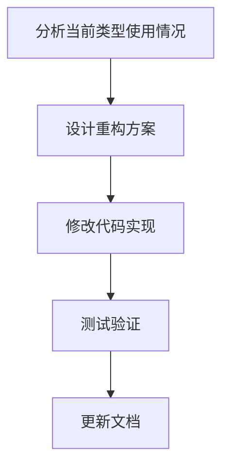

# 元数据
工作流程: tasker-v2.9.md
任务ID: refactor_xc_val_type
当前角色: analyst
下一角色: planner
状态: pending
状态描述: "任务初始化"
创建: "2023-11-15 10:00:00"
更新: "2023-11-15 10:00:00"
完成: "取消"
评价状态: "未评价"
评价结果: ""
评价时间: ""
评价理由: ""
协作模式: "串行"
子任务IDs: []
父任务ID: ""

# 最初任务描述
> 重构 xc 项目中的类型系统，将 xc_object_t 改名为 xc_val，统一这两个概念，解决当前 xc_{type}.c 文件过度依赖 xc_internal.h 的问题。

# 当前任务
分析当前 xc 项目中 xc_val 和 xc_object_t 的使用情况，设计重构方案，将 xc_object_t 改名为 xc_val，统一这两个概念。

# 当前状态
任务刚刚创建，需要进行需求分析和方案设计。

# 规划图表

# 执行计划
1. 分析当前 xc_val 和 xc_object_t 的使用情况
2. 设计重构方案
3. 实施代码修改
4. 测试验证
5. 更新文档

# 测试方法和命令
测试命令:
- `make clean && make`: 确保项目能够正常编译
- `make test`: 运行项目测试套件，确保功能正常

# 测试结果
尚未执行测试。

# 任务评价标准
- [ ] 功能完整性：所有使用 xc_object_t 的地方都改为 xc_val，保持功能不变
- [ ] 代码质量：修改后的代码清晰，没有不必要的类型转换
- [ ] 性能指标：重构不应影响性能
- [ ] 用户体验：不适用
- [ ] 安全性：不适用

# 工作记录
## 分析师 (2023-11-15 10:00:00)
经过分析，当前项目中存在两个概念：
1. xc_val：在 xc.h 中定义为 void*，作为公共接口使用
2. xc_object_t：在 xc_internal.h 中定义为结构体，作为内部实现使用

这导致了各个 xc_{type}.c 文件需要直接依赖 xc_internal.h，违反了模块化设计原则。

重构方案将统一这两个概念，直接将 xc_object_t 改名为 xc_val，消除不必要的抽象层和类型转换。

具体步骤如下：
1. 在 xc.h 中定义新的 xc_val 结构体
2. 修改所有使用 xc_object_t 的代码，改为使用 xc_val
3. 修改所有函数签名，将 void* xc_val 改为 xc_val*
4. 移除所有不必要的类型转换
5. 更新文档和注释，反映新的类型设计

### 完成项
- [x] 分析当前类型使用情况
- [x] 设计初步重构方案

### 交接清单
- [ ] 详细设计重构方案，包括具体的代码修改步骤
- [ ] 评估潜在风险和兼容性问题
- [ ] 制定详细的测试计划

### 反馈记录
用户反馈：用户确认了重构方案的方向，希望统一 xc_val 和 xc_object_t 的概念，简化代码结构。 