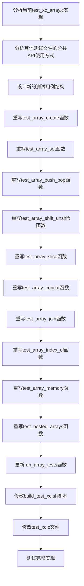

# 元数据
工作流程: tasker-v2.9.md
任务ID: rewrite_array_tests_001
当前角色: planner
下一角色: executor
状态: in_progress
状态描述: "规划设计阶段"
创建: "2024-03-06 17:55:00"
更新: "2024-03-06 18:00:00"
完成: "可能完成"
评价状态: "未评价"
评价结果: ""
评价时间: ""
评价理由: ""
协作模式: "串行"
子任务IDs: []
父任务ID: ""

# 最初任务描述
> 重写test_xc_array.c文件，使其使用公共API而非内部函数，以便正确集成到测试套件中。

# 当前任务
重写test_xc_array.c文件，使其使用公共API（通过xc结构）而非直接调用内部函数。当前的test_xc_array.c文件直接使用了内部API函数（如xc_array_create、xc_array_push等），导致编译错误。需要参考其他测试文件（如test_xc_types.c）的实现方式，使用公共API接口进行测试。

# 当前状态
我们已经修复了xc_array.c文件中的编译错误，但为了让测试套件能够正常运行，暂时注释掉了test_xc_array.c文件的引用和run_array_tests()函数的调用。现在需要重写test_xc_array.c文件，使其能够正确集成到测试套件中。规划员已完成详细设计方案，准备交给执行员实施。

# 规划图表

# 执行计划
1. 分析当前test_xc_array.c实现，了解需要重写的测试函数
2. 分析其他测试文件（如test_xc_types.c）的公共API使用方式
3. 设计新的测试用例结构，确保与其他测试文件保持一致
4. 逐个重写测试函数，使用公共API替代内部函数
5. 更新run_array_tests函数，确保正确注册和运行测试
6. 修改build_test_xc.sh脚本，取消对test_xc_array.c的注释
7. 修改test_xc.c文件，取消对run_array_tests()的注释
8. 测试完整实现，确保所有测试能够正常运行

# 测试方法和命令
测试命令:
- `make`: 构建libxc.a并运行测试
- `./test/test_xc.exe`: 直接运行测试程序

# 测试结果
## 调试员执行记录 (尚未执行)
- 待执行

# 任务评价标准
- [ ] 功能完整性：所有数组操作都有对应的测试用例
- [ ] 代码质量：测试代码结构清晰，与其他测试文件风格一致
- [ ] 性能指标：测试执行速度合理，不会导致测试套件运行时间过长
- [ ] 用户体验：测试输出信息清晰，便于理解测试结果
- [ ] 安全性：测试代码不会导致内存泄漏或其他安全问题

# 工作记录
## 分析师 (2024-03-06 17:55:00)
初步分析了当前问题和需求。我们需要重写test_xc_array.c文件，使其使用公共API而非内部函数。

当前的test_xc_array.c文件直接使用了内部API函数（如xc_array_create、xc_array_push等），这导致了编译错误。我们需要参考其他测试文件（如test_xc_types.c）的实现方式，使用公共API接口进行测试。

主要需要重写的函数包括：
1. test_array_create
2. test_array_set
3. test_array_push_pop
4. test_array_shift_unshift
5. test_array_slice
6. test_array_concat
7. test_array_join
8. test_array_index_of
9. test_array_memory
10. test_nested_arrays
11. run_array_tests

重写后，需要修改build_test_xc.sh脚本和test_xc.c文件，取消对test_xc_array.c和run_array_tests()的注释，使其能够正确集成到测试套件中。

### 完成项
- [x] 初步分析问题和需求
- [x] 确定需要重写的函数列表
- [x] 创建任务规划图表

### 交接清单
- [ ] 设计详细的重写方案，包括每个函数的具体实现方式
- [ ] 确定公共API与内部函数的映射关系
- [ ] 制定测试策略，确保重写后的测试能够正确验证数组功能

### 反馈记录
用户反馈：需要按照tasker-v2.9.md的工作流程创建任务文件，并重写test_xc_array.c文件，使其使用公共API而非内部函数。

## 规划员 (2024-03-06 18:00:00)
基于分析师的初步分析，我已完成了详细的重写方案设计。

### 公共API与内部函数的映射关系

| 内部函数 | 公共API | 说明 |
|---------|---------|------|
| xc_array_create | xc.create(XC_TYPE_ARRAY) | 创建空数组 |
| xc_array_create_with_capacity | xc.create(XC_TYPE_ARRAY, capacity) | 创建指定容量的数组 |
| xc_array_length | xc.call(array, "length") | 获取数组长度 |
| xc_array_get | xc.call(array, "get", index) | 获取数组元素 |
| xc_array_set | xc.call(array, "set", index, value) | 设置数组元素 |
| xc_array_push | xc.call(array, "push", value) | 向数组末尾添加元素 |
| xc_array_pop | xc.call(array, "pop") | 移除并返回数组末尾元素 |
| xc_array_unshift | xc.call(array, "unshift", value) | 向数组开头添加元素 |
| xc_array_shift | xc.call(array, "shift") | 移除并返回数组开头元素 |
| xc_array_slice | xc.call(array, "slice", start, end) | 截取数组片段 |
| xc_array_concat | xc.call(array1, "concat", array2) | 连接两个数组 |
| xc_array_join | xc.call(array, "join", separator) | 将数组元素连接为字符串 |
| xc_array_find_index | xc.call(array, "indexOf", value) | 查找元素在数组中的索引 |
| xc_array_find_index_from | xc.call(array, "indexOf", value, fromIndex) | 从指定位置开始查找元素索引 |

### 测试函数重写方案

1. **test_array_create**
   - 使用xc.create(XC_TYPE_ARRAY)创建空数组
   - 使用xc.is(array, XC_TYPE_ARRAY)检查类型
   - 使用xc.call(array, "length")检查长度

2. **test_array_set**
   - 创建数组并使用xc.call(array, "set", index, value)设置元素
   - 使用xc.call(array, "get", index)获取元素并验证

3. **test_array_push_pop**
   - 创建数组并使用xc.call(array, "push", value)添加元素
   - 使用xc.call(array, "pop")移除元素并验证

4. **test_array_shift_unshift**
   - 创建数组并使用xc.call(array, "unshift", value)添加元素
   - 使用xc.call(array, "shift")移除元素并验证

5. **test_array_slice**
   - 创建数组并填充元素
   - 使用xc.call(array, "slice", start, end)截取片段并验证

6. **test_array_concat**
   - 创建两个数组并填充元素
   - 使用xc.call(array1, "concat", array2)连接数组并验证

7. **test_array_join**
   - 创建数组并填充元素
   - 使用xc.call(array, "join", separator)连接为字符串并验证

8. **test_array_index_of**
   - 创建数组并填充元素
   - 使用xc.call(array, "indexOf", value)查找元素索引并验证
   - 使用xc.call(array, "indexOf", value, fromIndex)从指定位置查找并验证

9. **test_array_memory**
   - 创建大型数组并进行内存操作测试
   - 使用xc.gc()触发垃圾回收并验证内存使用

10. **test_nested_arrays**
    - 创建嵌套数组结构
    - 验证嵌套数组的访问和操作

11. **run_array_tests**
    - 注册所有数组测试函数
    - 使用test_register函数将测试添加到测试套件

### 测试策略
1. 单元测试：每个函数独立测试一个数组操作
2. 集成测试：测试多个操作的组合使用
3. 边界测试：测试边界条件（空数组、大数组、无效索引等）
4. 错误测试：测试错误处理（无效参数、类型错误等）

### 完成项
- [x] 分析公共API与内部函数的映射关系
- [x] 设计每个测试函数的重写方案
- [x] 制定测试策略

### 交接清单
- [ ] 按照设计方案重写test_xc_array.c文件
- [ ] 修改build_test_xc.sh脚本，取消对test_xc_array.c的注释
- [ ] 修改test_xc.c文件，取消对run_array_tests()的注释
- [ ] 运行测试并验证功能 