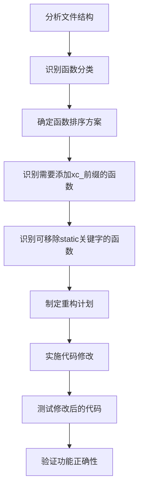

# 元数据
工作流程: tasker-v2.9.md
任务ID: xc_code_refactor_001
当前角色: analyst
下一角色: planner
状态: pending
状态描述: "任务初始化"
创建: "2025-07-03 15:52:00"
更新: "2025-07-03 15:52:00"
完成: "取消或完成"
评价状态: "未评价"
评价结果: ""
评价时间: ""
评价理由: ""
协作模式: "串行"
子任务IDs: []
父任务ID: ""

# 最初任务描述
> 读取并理解 xc.c 和 xc_internal.h 文件的内容
> 按功能调整这两个文件中函数的排序
> 确保所有函数都有 xc_ 前缀
> 移除不必要的 static 关键字

# 当前任务
分析xc.c和xc_internal.h文件的结构和内容，理解其功能和组织方式，为后续的代码重构做准备。

# 当前状态
任务刚刚创建，需要进行初步分析。

# 规划图表

# 执行计划
1. 分析xc.c和xc_internal.h文件的结构和内容
2. 识别文件中的函数并按功能分类
3. 确定函数的最佳排序方式
4. 识别需要添加xc_前缀的函数
5. 识别可以移除static关键字的函数
6. 制定详细的重构计划

# 测试方法和命令
测试命令:
- `make clean && make`: 确保代码可以正常编译
- `./bin/test_xc.exe.aarch64.elf`: 运行基本测试，确保功能正常
- `./bin/test_internal.exe.aarch64.elf`: 运行内部测试，验证内部API功能
- `./bin/test_external.exe.aarch64.elf`: 运行外部测试，验证外部API功能

# 测试结果
## 调试员执行记录 (待填写)
- 测试命令执行结果
- 发现的问题
- 解决方案

# 任务评价标准
- [ ] 功能完整性：重构后的代码保持原有功能，所有测试通过
- [ ] 代码质量：函数按功能分组，命名规范统一，结构清晰
- [ ] 性能指标：重构不影响性能，保持原有效率
- [ ] 可维护性：代码组织更加合理，易于理解和维护
- [ ] 兼容性：重构不破坏现有API，保持向后兼容

# 工作记录
## 分析师 (2025-07-03 15:52:00)
初步分析了任务需求，确定了重构的主要目标：
1. 按功能调整xc.c和xc_internal.h中函数的排序
2. 确保所有函数都有xc_前缀
3. 移除不必要的static关键字

这项任务属于代码重构，目的是提高代码的可维护性和一致性，不涉及功能变更。需要仔细分析文件结构，确保修改不破坏现有功能。

### 完成项
- [x] 创建任务文档
- [x] 初步分析任务需求
- [x] 制定初步规划图表

### 交接清单
- [ ] 详细分析xc.c和xc_internal.h文件结构
- [ ] 按功能对函数进行分类
- [ ] 确定函数的最佳排序方式
- [ ] 识别需要添加xc_前缀的函数
- [ ] 识别可以移除static关键字的函数
- [ ] 制定详细的重构计划

### 反馈记录
用户反馈：用户要求按照tasker-v2.9.md创建任务文档，关于重构xc.c和xc_internal.h文件的任务。