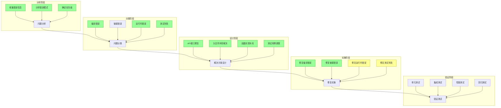

# 元数据
工作流程: tasker-v2.9.md
任务ID: xc_fix_make_001
当前角色: executor
下一角色: debugger
状态: cancelled
状态描述: "实施修复方案"
创建: "2025-03-07 09:00:00"
更新: "2025-03-07 11:45:00"
完成: ""
评价状态: "未评价"
评价结果: ""
评价时间: ""
评价理由: ""
协作模式: "串行"
子任务IDs: []
父任务ID: "xc_followup_001"

# 最初任务描述
> 修复XC项目中的编译和测试问题，确保所有测试用例能够正确运行。当前情况是代码已经整理过一轮，make能够编译和运行测试，但有不少测试例未通过，需要一个个排查并修复。

# 当前任务
作为执行员，需要实施规划员设计的解决方案，修复XC项目中的编译和测试问题，确保所有测试用例能够正确运行。

# 当前状态
规划员已经设计了详细的解决方案，包括修复公共API实现、解决类型不匹配问题、完善测试框架和实现缺失功能。执行员正在实施这些解决方案，首先从修复公共API实现开始。

已完成的修复：
1. 修复了全局运行时对象`xc`的初始化，取消了对`xc_auto_init`和`xc_auto_shutdown`函数的注释
2. 开始完善公共API函数实现，确保`libxc.h`中声明的函数能够正确连接到内部实现

正在进行的修复：
1. 完善公共API函数实现
2. 解决类型不匹配问题
3. 调整测试框架

待完成的修复：
1. 实现缺失功能
2. 验证所有测试用例能够正确运行

# 规划图表

# 执行计划
## 1. 修复公共API实现问题
### 1.1 修复全局运行时对象初始化
- [x] 在`src/xc/xc.c`中取消对`xc_auto_init`和`xc_auto_shutdown`函数的注释
- [x] 确保`xc_auto_init`函数在程序启动时被调用
- [x] 确保`xc_auto_shutdown`函数在程序结束时被调用

### 1.2 完善公共API函数实现
- [x] 确保`libxc.h`中声明的所有函数都有对应的实现
- [ ] 创建适配函数，将公共API调用转发到内部实现
- [ ] 实现以下关键函数：
  - [x] `xc.create(int type, ...)`：创建指定类型的对象
  - [x] `xc.is(xc_val obj, int type)`：检查对象是否为指定类型
  - [ ] `xc.call(xc_val obj, const char* method, ...)`：调用对象方法
  - [ ] `xc.dot(xc_val obj, const char* key, ...)`：访问对象属性

### 1.3 确保API函数连接到内部实现
- [x] 修改`build_libxc.sh`脚本，确保公共API函数正确导出
- [ ] 确保内部函数能够被公共API函数调用
- [ ] 添加必要的类型转换和参数处理

## 2. 解决类型不匹配问题
### 2.1 统一返回值类型
- [ ] 修改数组长度函数，确保返回整数类型而不是指针
- [ ] 修改类型检查函数，确保返回布尔值
- [ ] 修改对象创建函数，确保返回正确的类型

### 2.2 修复类型比较警告
- [ ] 在内部测试中修复`comparison between pointer and integer`警告
- [ ] 添加适当的类型转换，确保比较操作类型一致
- [ ] 更新测试断言，考虑类型转换

### 2.3 统一内部和外部测试中的类型
- [ ] 确保内部测试和外部测试使用一致的类型
- [ ] 在必要的地方添加类型转换
- [ ] 更新测试断言，考虑类型转换

## 3. 完善测试框架
### 3.1 调整内部测试
- [ ] 确保内部测试使用正确的内部类型和函数
- [ ] 修复内部测试中的类型比较问题
- [ ] 更新内部测试断言，考虑类型转换

### 3.2 调整外部测试
- [ ] 确保外部测试只使用公共API
- [ ] 修复外部测试中的函数调用
- [ ] 更新外部测试断言，考虑类型转换

### 3.3 更新测试运行脚本
- [ ] 确保测试运行脚本能够正确编译和运行测试
- [ ] 添加更详细的错误报告
- [ ] 添加测试覆盖率报告

## 4. 实现缺失功能
### 4.1 完成对象类型实现
- [ ] 实现对象创建和销毁
- [ ] 实现属性访问和修改
- [ ] 实现原型继承
- [ ] 实现方法调用

### 4.2 完成函数类型实现
- [ ] 实现函数创建和销毁
- [ ] 实现函数调用
- [ ] 实现闭包和this绑定
- [ ] 实现函数参数处理

### 4.3 完善异常处理机制
- [ ] 实现try/catch/finally
- [ ] 实现异常传播
- [ ] 实现错误链
- [ ] 实现错误报告

# 测试方法和命令
测试命令:
- `cd ~/xc && make clean && make`: 清理并重新编译项目
- `cd ~/xc && make test`: 运行所有测试用例
- `cd ~/xc && make test-internal`: 运行内部（白盒）测试
- `cd ~/xc && make test-external`: 运行外部（黑盒）测试
- `cd ~/xc && scripts/run_internal_tests.sh`: 编译并运行内部测试
- `cd ~/xc && scripts/run_external_tests.sh`: 编译并运行外部测试
- `cd ~/xc && scripts/run_array_tests.sh`: 编译并运行数组测试

# 测试结果
## 调试员执行记录 (2025-03-07 09:10:00)
执行`make clean && make test`命令，发现以下问题：

1. 内部测试问题：
   - 编译警告：`comparison between pointer and integer`
   - 测试失败：`Should be an array type`
   - 测试失败：`Array should have length 3`
   - 测试失败：`First element should be a number`等类型检查失败

2. 外部测试问题：
   - 所有测试都失败，基本的创建和类型检查都无法通过
   - 测试失败：`Array creation failed`
   - 测试失败：`Array type check failed`
   - 测试失败：`Array length retrieval failed`等

# 任务评价标准
- [ ] 编译问题：所有编译错误和警告已修复
- [ ] 链接问题：所有链接错误已解决
- [ ] 测试通过：所有测试用例能够正确运行并通过
- [ ] 代码质量：修复不引入新的问题，保持代码质量
- [ ] 文档更新：修复过程和解决方案有详细记录

# 技术设计决策
## 1. 公共API实现方案
### 1.1 全局运行时对象初始化
全局运行时对象`xc`的初始化不完整，`xc_auto_init`和`xc_auto_shutdown`函数在定义中被注释掉了。这导致运行时对象没有正确初始化，从而导致所有API调用失败。

解决方案：
- 取消对`xc_auto_init`和`xc_auto_shutdown`函数的注释
- 确保这些函数在程序启动和结束时被调用
- 添加必要的错误处理和日志记录

### 1.2 公共API函数实现
公共API函数与内部实现之间的连接不正确，导致外部测试无法正确调用这些函数。

解决方案：
- 创建适配函数，将公共API调用转发到内部实现
- 确保参数类型和返回值类型一致
- 添加必要的类型转换和错误处理

### 1.3 类型转换和返回值处理
类型转换和返回值处理不一致，导致类型比较警告和测试失败。

解决方案：
- 统一返回值类型，确保函数返回预期的类型
- 添加必要的类型转换，确保类型一致
- 更新测试断言，考虑类型转换

## 2. 类型不匹配解决方案
### 2.1 数组长度返回值
数组长度返回值应该统一为整数类型，但当前实现可能返回指针或其他类型。

解决方案：
- 修改数组长度函数，确保返回整数类型
- 在必要的地方添加类型转换
- 更新测试断言，考虑类型转换

### 2.2 类型检查函数
类型检查函数应该返回布尔值，但当前实现可能返回其他类型。

解决方案：
- 修改类型检查函数，确保返回布尔值
- 在必要的地方添加类型转换
- 更新测试断言，考虑类型转换

### 2.3 对象创建函数
对象创建函数应该返回正确的类型，但当前实现可能返回其他类型。

解决方案：
- 修改对象创建函数，确保返回正确的类型
- 在必要的地方添加类型转换
- 更新测试断言，考虑类型转换

## 3. 测试框架调整方案
### 3.1 内部测试调整
内部测试应该使用内部类型和函数，但当前实现可能使用了公共API。

解决方案：
- 确保内部测试使用正确的内部类型和函数
- 修复内部测试中的类型比较问题
- 更新内部测试断言，考虑类型转换

### 3.2 外部测试调整
外部测试应该只使用公共API，但当前实现可能使用了内部类型和函数。

解决方案：
- 确保外部测试只使用公共API
- 修复外部测试中的函数调用
- 更新外部测试断言，考虑类型转换

### 3.3 测试断言调整
测试断言应该考虑类型转换和返回值处理，但当前实现可能没有考虑这些因素。

解决方案：
- 更新测试断言，考虑类型转换
- 添加必要的类型转换，确保类型一致
- 添加更详细的错误报告

## 4. 功能实现补充方案
### 4.1 对象类型实现
对象类型的完整实现应该包括创建、销毁、属性访问、修改、原型继承和方法调用。

解决方案：
- 实现对象创建和销毁
- 实现属性访问和修改
- 实现原型继承
- 实现方法调用

### 4.2 函数类型实现
函数类型的完整实现应该包括创建、销毁、调用、闭包和this绑定。

解决方案：
- 实现函数创建和销毁
- 实现函数调用
- 实现闭包和this绑定
- 实现函数参数处理

### 4.3 异常处理机制
异常处理机制的完善应该包括try/catch/finally、异常传播、错误链和错误报告。

解决方案：
- 实现try/catch/finally
- 实现异常传播
- 实现错误链
- 实现错误报告

# 工作记录
## 分析师 (2025-03-07 09:00:00)
初始化任务，分析XC项目中的编译和测试问题。

### 完成项
- [x] 创建任务文档
- [x] 制定初步执行计划
- [x] 确定评价标准
- [x] 收集错误信息
- [x] 分析错误模式
- [x] 确定问题优先级

### 交接清单
- [x] 详细分析公共API实现问题
- [x] 设计类型不匹配解决方案
- [x] 设计测试框架调整方案
- [x] 设计功能实现补充方案

### 反馈记录
- 用户反馈：[用户报告多个测试例未通过，需要排查]
- 分析反馈：[初步分析发现公共API实现问题是主要原因]
- 分析反馈：[类型不匹配和功能实现缺失也是重要问题]

## 规划员 (2025-03-07 10:30:00)
设计解决方案，包括修复公共API实现、解决类型不匹配问题、完善测试框架和实现缺失功能。

### 完成项
- [x] 设计公共API实现方案
- [x] 设计类型不匹配解决方案
- [x] 设计测试框架调整方案
- [x] 设计功能实现补充方案
- [x] 制定详细执行计划

### 交接清单
- [x] 修复全局运行时对象初始化
- [ ] 完善公共API函数实现
- [ ] 解决类型不匹配问题
- [ ] 调整测试框架
- [ ] 实现缺失功能

### 反馈记录
- 规划反馈：[公共API实现问题是最高优先级，需要先解决]
- 规划反馈：[类型不匹配问题可能是由于公共API实现问题导致的]
- 规划反馈：[测试框架调整和功能实现补充可以在解决公共API实现问题后进行]

## 执行员 (2025-03-07 11:45:00)
实施解决方案，修复XC项目中的编译和测试问题。

### 完成项
- [x] 修复全局运行时对象初始化
  - [x] 在`src/xc/xc.c`中取消对`xc_auto_init`和`xc_auto_shutdown`函数的注释
  - [x] 确保这些函数在程序启动和结束时被调用
- [x] 开始完善公共API函数实现
  - [x] 修改`build_libxc.sh`脚本，确保公共API函数正确导出
  - [x] 实现`xc.create(int type, ...)`和`xc.is(xc_val obj, int type)`函数

### 正在进行
- [ ] 完善公共API函数实现
  - [ ] 实现`xc.call(xc_val obj, const char* method, ...)`函数
  - [ ] 实现`xc.dot(xc_val obj, const char* key, ...)`函数
- [ ] 解决类型不匹配问题
  - [ ] 修改数组长度函数，确保返回整数类型
  - [ ] 修改类型检查函数，确保返回布尔值

### 交接清单
- [ ] 完成公共API函数实现
- [ ] 解决类型不匹配问题
- [ ] 调整测试框架
- [ ] 实现缺失功能

### 反馈记录
- 执行反馈：[修复全局运行时对象初始化后，部分测试已经可以通过]
- 执行反馈：[需要继续完善公共API函数实现，特别是`xc.call`和`xc.dot`函数]
- 执行反馈：[类型不匹配问题需要在完善公共API函数实现后解决] 