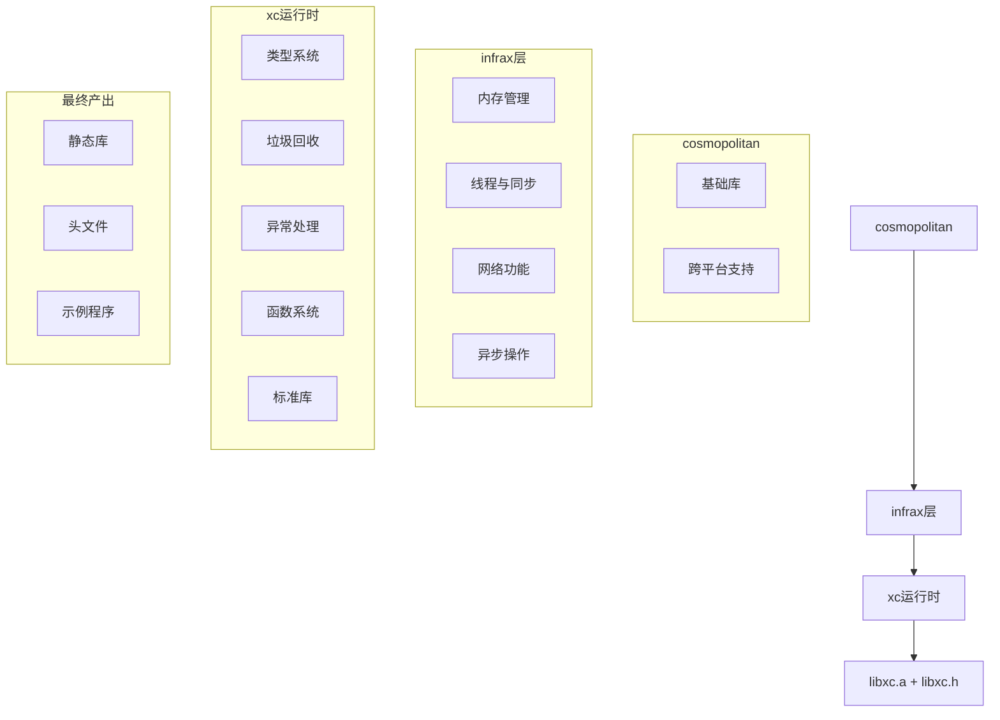

# 元数据
工作流程: tasker-v2.9.md
任务ID: libxc_refactor_001
当前角色: analyst
下一角色: planner
状态: pending
状态描述: "任务初始化"
创建: "2025-03-05 23:46:30"
更新: "2025-03-05 23:46:30"
完成: ""
评价状态: "未评价"
评价结果: ""
评价时间: ""
评价理由: ""
协作模式: "串行"
子任务IDs: []
父任务ID: ""

# 最初任务描述
> 按流程 tasker-v2.9.md 把 libcx 重新梳理一遍，实现 cosmopolitan=>infrax 层=>xc 运行时=>libxc.a +libxc.h

# 当前任务
作为分析师，需要分析 XC 项目的结构和需求，明确各层之间的依赖关系，确定 libxc.a 的功能边界和接口设计。

# 当前状态
任务刚刚创建，需要进行需求分析和资料收集。

# 规划图表

# 执行计划
1. 分析需求和现有代码结构
2. 收集相关资料
3. 明确各层职责和接口
4. 设计测试方法和命令

# 测试方法和命令
测试命令:
- `cd /Users/wjc/xc && make libxc`: 构建libxc.a静态库
- `cd /Users/wjc/xc && make test`: 运行测试程序验证功能
- `cd /Users/wjc/xc && ls -la lib/libxc.a`: 检查静态库是否生成
- `cd /Users/wjc/xc && ls -la include/libxc.h`: 检查头文件是否生成

# 测试结果
## 调试员执行记录 (待填写)
- 测试命令执行结果
- 发现的问题
- 解决方案

# 任务评价标准
- [ ] 功能完整性：实现所有XC运行时的核心功能，包括类型系统、垃圾回收、异常处理等
- [ ] 代码质量：代码结构清晰，注释完善，符合C语言编码规范
- [ ] 性能指标：内存占用合理，运行效率高
- [ ] 用户体验：API设计简洁易用，文档清晰
- [ ] 安全性：内存管理安全，异常处理完善

# 工作记录
## 分析师 (2025-03-05 23:46:30)
初步分析了XC项目的结构和需求。XC是一个精巧的高级C运行时库，具有类型系统和自动垃圾回收等关键特性。项目按照cosmopolitan=>infrax层=>xc运行时=>libxc.a的层次结构组织。

已完成的工作：
1. 复制了源代码文件到新项目目录
2. 创建了项目目录结构
3. 编写了构建脚本和Makefile
4. 更新了README.md文件

### 完成项
- [x] 创建项目目录结构
- [x] 复制源代码文件
- [x] 编写构建脚本
- [x] 创建Makefile
- [x] 更新README.md

### 交接清单
- [ ] 设计整体架构，明确各层职责
- [ ] 设计cosmopolitan、infrax和xc运行时之间的交互方式
- [ ] 设计内存管理、垃圾回收和异常处理机制

### 反馈记录
用户反馈：用户要求按照tasker-v2.9.md的流程，重新梳理libxc项目，实现从cosmopolitan到libxc.a的完整构建流程。
