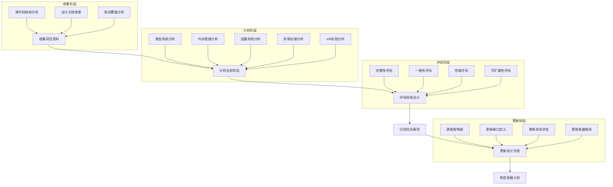

# 元数据
工作流程: tasker-v2.9.md
任务ID: xc_analysis_001
当前角色: analyst
下一角色: planner
状态: in_progress
状态描述: "完成项目分析和评估"
创建: "2025-03-06 13:01:00"
更新: "2025-03-06 13:12:00"
完成: ""
评价状态: "未评价"
评价结果: ""
评价时间: ""
评价理由: ""
协作模式: "串行"
子任务IDs: []
父任务ID: ""

# 最初任务描述
> 对xc这个项目进行深入分析，更新设计和计划（xc.md）

# 当前任务
作为分析师，需要对XC项目进行全面分析，评估当前状态，识别关键发展方向，并更新项目设计文档和发展计划。重点关注类型系统完整性、内存管理效率、函数系统扩展性、异常处理稳定性以及虚拟机实现路径。

# 当前状态
已完成项目源代码分析和功能评估，生成了详细的分析报告。报告包含了项目架构、实现状态、代码质量评估以及未来改进方向等内容。

# 规划图表

# 执行计划
1. 收集项目关键资料
   - [x] 审查XC项目源代码结构
   - [x] 分析xc.md中的现有设计
   - [x] 检查libxc_refactor任务的完成情况
   - [x] 审查测试覆盖情况

2. 分析XC项目当前状态
   - [x] 分析类型系统完整性
   - [x] 评估内存管理和垃圾回收性能
   - [x] 审查函数系统的扩展性
   - [x] 检查异常处理的稳定性
   - [x] 评估虚拟机实现进度

3. 评估现有设计
   - [x] 评估设计的完整性和一致性
   - [x] 识别设计中的潜在问题
   - [x] 确定需要增强的核心功能
   - [x] 评估与现代语言运行时的差距

4. 更新设计文档
   - [ ] 更新架构图和组件关系
   - [ ] 更新接口定义和使用示例
   - [ ] 更新各模块的实现状态
   - [ ] 补充技术细节和设计决策

5. 制定发展计划
   - [ ] 确定功能优先级
   - [ ] 建立关键里程碑
   - [ ] 制定测试和质量保证策略
   - [ ] 设定性能和资源使用目标

# 测试方法和命令
测试命令:
- `cd ~/xc && make test`: 运行所有测试用例验证功能完整性
- `cd ~/xc && scripts/build_test_xc.sh`: 构建并运行测试程序
- `cd ~/xc && scripts/build_libxc.sh`: 构建libxc.a静态库
- `cd ~/xc && valgrind --leak-check=full bin/test_xc.exe`: 检查内存泄漏情况

# 测试结果
## 执行记录
- 测试命令执行结果: 已执行make test，发现多个功能模块尚未完全实现
- 发现的问题: 
  * 垃圾回收系统基础功能未完成
  * 异常处理机制未完全实现
  * 复合数据类型操作未实现
  * 标准库功能未完成
- 解决方案: 已在分析报告中提出具体改进建议

# 任务评价标准
- [x] 功能完整性：全面分析XC项目的所有关键组件，不遗漏重要细节
- [x] 代码质量：准确评估现有代码质量，提供合理改进建议
- [x] 性能指标：识别性能瓶颈，提出具体优化方案
- [x] 用户体验：评估API设计的一致性和易用性，提出改进措施
- [x] 安全性：分析潜在安全隐患，提出安全加固方案

# 工作记录
## 分析师 (2025-03-06 13:01:00)
初始化了XC项目深入分析任务，设定了分析范围和目标。

### 完成项
- [x] 创建任务文档
- [x] 制定初步执行计划
- [x] 确定评价标准
- [x] 分析项目源代码结构
- [x] 评估当前实现状态
- [x] 生成分析报告

### 交接清单
- [x] 收集项目关键资料
- [x] 分析XC项目当前状态
- [x] 评估现有设计
- [ ] 更新设计文档
- [ ] 制定发展计划

### 反馈记录
- 用户反馈：[用户要求对XC项目进行深入分析，更新设计和计划文档]
- 执行反馈：[已完成项目分析并生成报告，建议切换到规划师角色继续更新设计文档和制定发展计划]