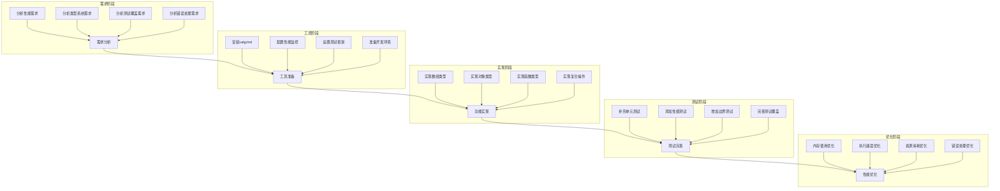

# 元数据
工作流程: tasker-v2.9.md
任务ID: xc_followup_001
当前角色: analyst
下一角色: architect
状态: pending
状态描述: "XC项目后续改进任务"
创建: "2025-03-06 13:32:00"
更新: "2025-03-06 13:32:00"
完成: ""
评价状态: "未评价"
评价结果: ""
评价时间: ""
评价理由: ""
协作模式: "串行"
子任务IDs: []
父任务ID: "xc_analysis_001"

# 最初任务描述
> 实施XC项目分析后的后续改进建议，包括安装性能分析工具、实现复合类型功能、补充单元测试并完善错误处理

# 当前任务
作为分析师，需要详细规划XC项目后续改进工作，包括性能分析、类型系统完善、测试覆盖和错误处理等方面。

# 当前状态
此任务是xc_analysis_001的后续工作，基于之前的分析和改进结果，需要进一步完善XC项目。主要包括以下几个方面：

1. 性能分析工具安装与使用
2. 复合类型功能实现
3. 单元测试补充
4. 错误处理完善

# 规划图表

# 执行计划
1. 性能分析工具安装与配置
   - [ ] 安装valgrind工具
   - [ ] 配置内存泄漏检测
   - [ ] 设置性能监控指标
   - [ ] 建立性能基准测试

2. 复合类型功能实现
   - [ ] 完善数组类型实现
   - [ ] 完善对象类型实现
   - [ ] 实现函数类型闭包
   - [ ] 添加复合类型操作API

3. 单元测试补充
   - [ ] 补充数组类型测试
   - [ ] 补充对象类型测试
   - [ ] 添加函数类型测试
   - [ ] 增加复合操作测试

4. 错误处理完善
   - [ ] 完善异常处理机制
   - [ ] 添加错误恢复功能
   - [ ] 实现错误链功能
   - [ ] 完善错误报告机制

# 测试方法和命令
测试命令:
- `cd ~/xc && make test`: 运行所有测试用例
- `cd ~/xc && valgrind --leak-check=full bin/test_xc.exe`: 检查内存泄漏
- `cd ~/xc && scripts/build_test_xc.sh`: 构建并运行测试程序
- `cd ~/xc && scripts/run_performance_tests.sh`: 运行性能测试（待创建）

# 测试结果
尚未开始执行测试。

# 任务评价标准
- [ ] 性能工具：成功安装并配置valgrind，能够检测内存泄漏和性能问题
- [ ] 类型系统：完整实现数组、对象和函数类型，通过所有相关测试
- [ ] 测试覆盖：测试覆盖率达到80%以上，包括边界情况和错误处理
- [ ] 错误处理：异常处理机制完善，能够正确处理和报告各类错误

# 工作记录
## 分析师 (2025-03-06 13:32:00)
创建了XC项目后续改进任务，基于xc_analysis_001的分析结果和建议。

### 完成项
- [x] 创建任务文档
- [x] 制定初步执行计划
- [x] 确定评价标准
- [x] 设定优先级任务

### 交接清单
- [ ] 详细分析各项改进的技术要求
- [ ] 制定具体的实现方案
- [ ] 设计测试用例
- [ ] 规划性能优化策略

### 反馈记录
- 用户反馈：[用户要求创建后续任务记录改进建议]
- 执行反馈：[已创建后续任务文档，建议切换到架构师角色进行详细规划]