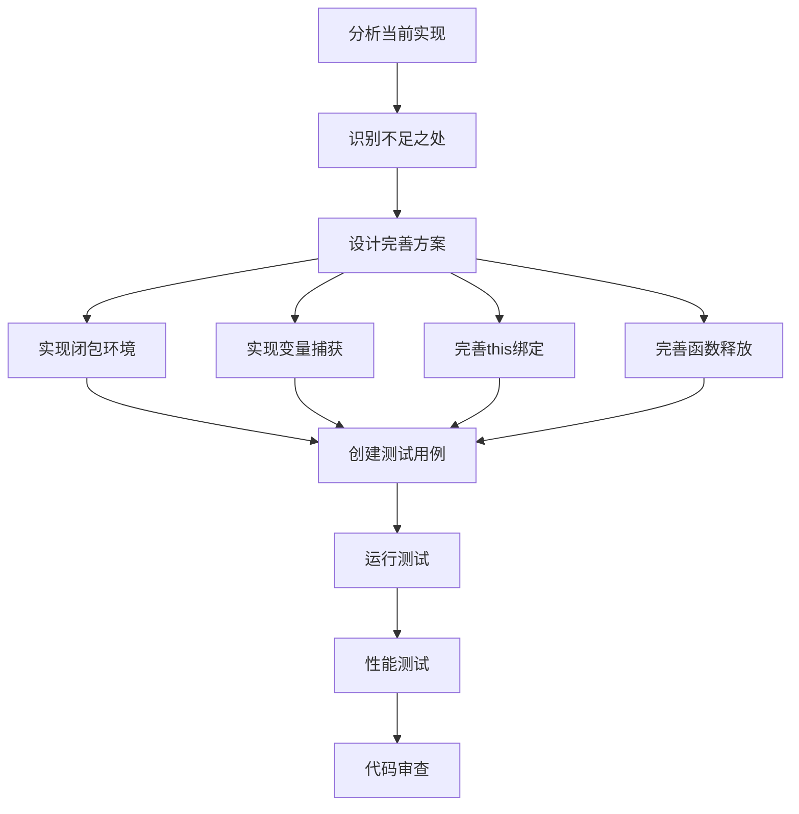

# 元数据
工作流程: tasker-v2.9.md
任务ID: xc_function_closure_impl_001
当前角色: analyst
下一角色: planner
状态: pending
状态描述: "任务初始化"
创建: "2025-03-08 17:27:00"
更新: "2025-03-08 17:27:00"
完成: ""
评价状态: "未评价"
评价结果: ""
评价时间: ""
评价理由: ""
协作模式: "串行"
子任务IDs: []
父任务ID: "xc_followup_001"

# 最初任务描述
> 完善XC项目中函数类型和闭包机制的实现，包括闭包环境创建、变量捕获、this绑定及闭包调用等功能

# 当前任务
作为分析师，需要分析当前函数类型和闭包机制的实现状态，确定需要完善的部分，并制定完善计划。主要包括闭包环境创建、变量捕获、this绑定及闭包调用等功能。

# 当前状态
通过代码审查发现，XC项目中的函数类型已有基本实现，包括函数创建和调用等基础功能。但在以下方面需要完善：

1. 闭包环境创建机制不完整
2. 变量捕获功能实现不足
3. this绑定机制（注释掉的xc_function_bind函数）未完成
4. 函数释放（function_free）函数内部逻辑不完整
5. 缺少完整的函数类型测试用例

# 规划图表


# 执行计划
1. 分析当前函数类型实现，包括函数创建、调用和基本闭包支持
2. 收集相关源码，理解项目架构
3. 确定需要完善的具体功能点
4. 制定详细的实施计划

# 测试方法和命令
测试将分为内部测试（白盒测试）和外部测试（黑盒测试）两部分：

1. **内部测试命令**:
```bash
make test-internal TESTS=test_function
```

2. **外部测试命令**:
```bash
make test-external TESTS=test_xc_function
```

3. **内存泄漏检测**:
```bash
./scripts/run_macos_memory_check.sh test_xc_function
```

4. **性能测试**:
```bash
./scripts/run_macos_performance.sh test_function_performance
```

# 参考资料和相关文件
- `/Users/wjc/xc/src/xc/xc_types/xc_function.c` - 函数类型实现源码
- `/Users/wjc/xc/src/xc/xc_internal.h` - 内部头文件
- `/Users/wjc/xc/include/libxc.h` - 公共API头文件
- `/Users/wjc/xc/test/internal/test_function.c` - 内部测试文件（如存在）
- `/Users/wjc/xc/test/external/test_xc_function.c` - 外部测试文件（如存在）
