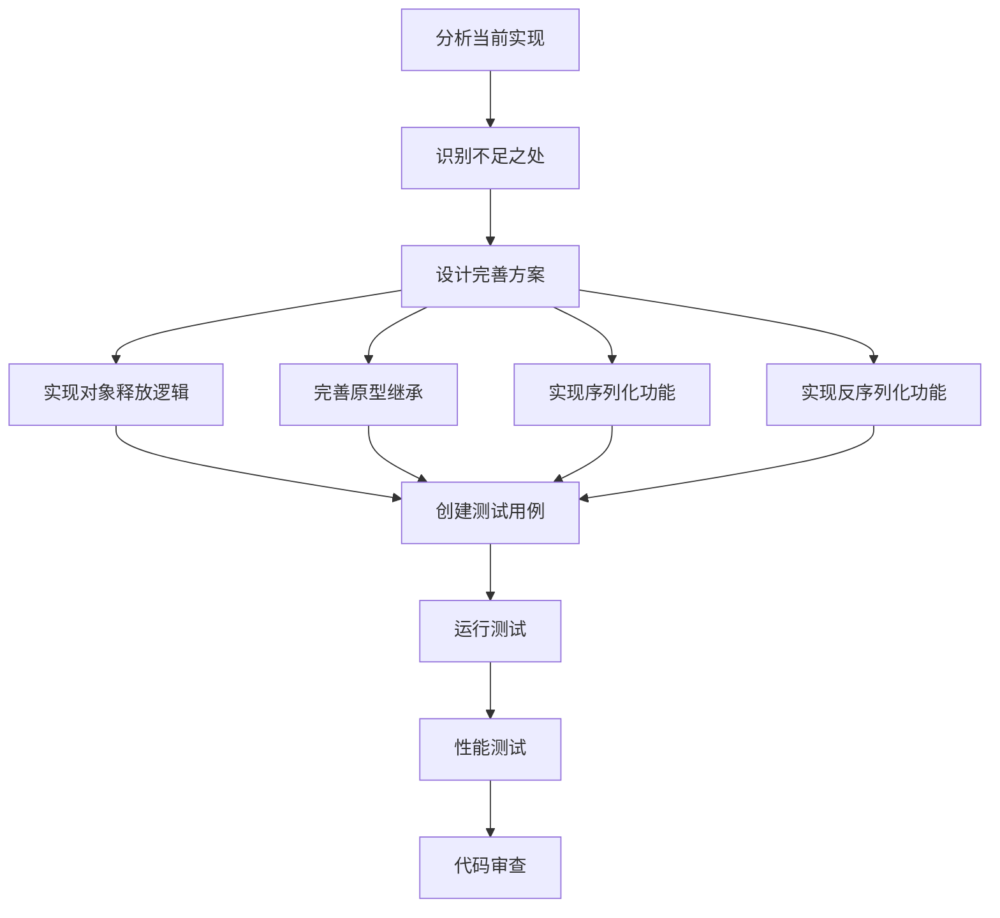

# 元数据
工作流程: tasker-v2.9.md
任务ID: xc_object_type_completion_001
当前角色: analyst
下一角色: planner
状态: pending
状态描述: "任务初始化"
创建: "2025-03-08 17:26:00"
更新: "2025-03-08 17:26:00"
完成: ""
评价状态: "未评价"
评价结果: ""
评价时间: ""
评价理由: ""
协作模式: "串行"
子任务IDs: []
父任务ID: "xc_followup_001"

# 最初任务描述
> 完善XC项目中对象类型的实现，包括对象释放逻辑、原型继承机制、属性管理和对象操作方法等

# 当前任务
作为分析师，需要分析当前对象类型实现的状态，确定需要完善的部分，并制定完善计划。主要包括对象释放逻辑、原型继承机制、属性管理和对象操作方法等方面。

# 当前状态
通过代码审查发现，XC项目中的对象类型已有基本实现，包括对象创建、属性访问和设置、原型链基本支持等。但在以下方面需要完善：

1. 对象释放逻辑中有未完成的代码（注释掉的TODO部分）
2. 原型继承机制实现不完整
3. 对象的序列化和反序列化功能尚未实现
4. 对象类型的内部和外部测试不完整

# 规划图表


# 执行计划
1. 分析当前对象类型实现，包括对象创建、属性管理和原型链支持
2. 收集相关源码，理解项目架构
3. 确定需要完善的具体功能点
4. 制定详细的实施计划

# 测试方法和命令
测试将分为内部测试（白盒测试）和外部测试（黑盒测试）两部分：

1. **内部测试命令**:
```bash
make test-internal TESTS=test_object
```

2. **外部测试命令**:
```bash
make test-external TESTS=test_xc_object
```

3. **内存泄漏检测**:
```bash
./scripts/run_macos_memory_check.sh test_xc_object
```

4. **性能测试**:
```bash
./scripts/run_macos_performance.sh test_object_performance
```

# 参考资料和相关文件
- `/Users/wjc/xc/src/xc/xc_types/xc_object.c` - 对象类型实现源码
- `/Users/wjc/xc/src/xc/xc_internal.h` - 内部头文件
- `/Users/wjc/xc/include/libxc.h` - 公共API头文件
- `/Users/wjc/xc/test/internal/test_object.c` - 内部测试文件（如存在）
- `/Users/wjc/xc/test/external/test_xc_object.c` - 外部测试文件（如存在）
