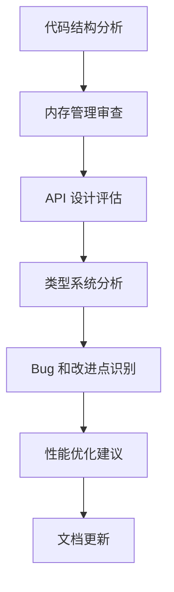

# 元数据
工作流程: tasker-v2.9.md
任务ID: xc_review
当前角色: analyst
下一角色: planner
状态: pending
状态描述: "任务初始化"
创建: "2023-11-15 14:00:00"
更新: "2023-11-15 14:00:00"
完成: ""
评价状态: "未评价"
评价结果: ""
评价时间: ""
评价理由: ""
协作模式: "串行"
子任务IDs: []
父任务ID: ""

# 最初任务描述
> 对 XC 项目进行全面代码审查，分析当前代码质量、架构设计和潜在问题，并提出改进建议。最终输出结果应更新到 docs/xc.md 文档中。

# 当前任务
对 XC 项目进行全面代码审查，包括但不限于：
1. 代码结构和组织评估
2. 内存管理机制审查（特别是最近从引用计数转向纯 GC 的变化）
3. API 设计和一致性分析
4. 类型系统实现评估
5. 潜在的 bug 和改进点识别
6. 性能优化机会

# 当前状态
任务刚刚创建，需要进行初步分析和规划。

# 规划图表

# 执行计划
1. 分析项目结构和代码组织
2. 审查内存管理机制，特别关注 GC 实现
3. 评估 API 设计和一致性
4. 分析类型系统实现
5. 识别潜在 bug 和改进点
6. 提出性能优化建议
7. 更新 docs/xc.md 文档

# 测试方法和命令
测试命令:
- `make clean && make`: 确保项目能够正常编译
- `make test`: 运行项目测试套件，验证功能正常
- `valgrind ./test_program`: 检查内存泄漏和其他内存问题

# 测试结果
尚未执行测试。

# 任务评价标准
- [ ] 全面性：审查覆盖所有关键代码模块和功能
- [ ] 深度：深入分析关键组件的实现细节
- [ ] 准确性：问题识别准确，建议合理可行
- [ ] 文档质量：更新的文档清晰、结构良好、信息丰富
- [ ] 实用性：提出的建议能够实际改进代码质量和性能

# 工作记录
## 分析师 (2023-11-15 14:00:00)
初步分析表明，XC 项目是一个运行时系统，包含内存管理、类型系统、对象模型等核心组件。最近项目进行了重要变更，从混合内存管理（引用计数 + GC）转向纯 GC 系统。

需要重点关注：
1. 内存管理转型过程中的潜在问题
2. 类型系统的一致性，特别是 xc_val 和 xc_object_t 的整合
3. API 设计的一致性和易用性
4. 代码模块间的依赖关系

审查结果将更新到 docs/xc.md 文档中，提供全面的项目概述、设计原则、API 参考和最佳实践。

### 完成项
- [x] 初步了解项目结构和最近变更

### 交接清单
- [ ] 详细分析项目结构和代码组织
- [ ] 制定详细的审查计划，包括重点关注的模块和方面
- [ ] 确定审查方法和工具

### 反馈记录
用户反馈：用户要求进行全面代码审查，特别关注最近的内存管理变更和类型系统整合，最终更新 docs/xc.md 文档。 