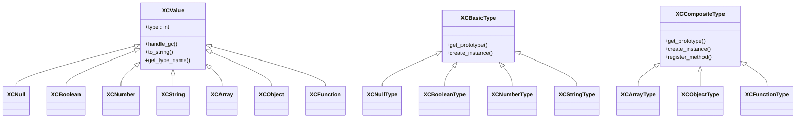
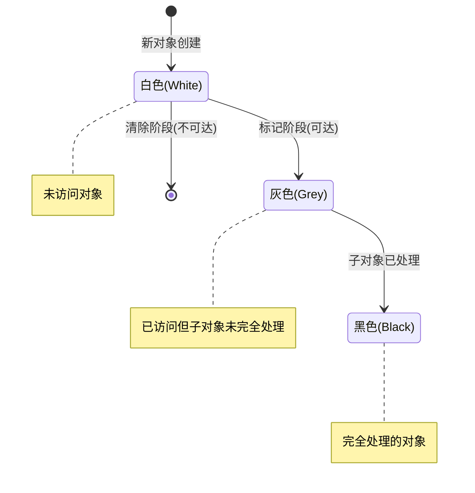
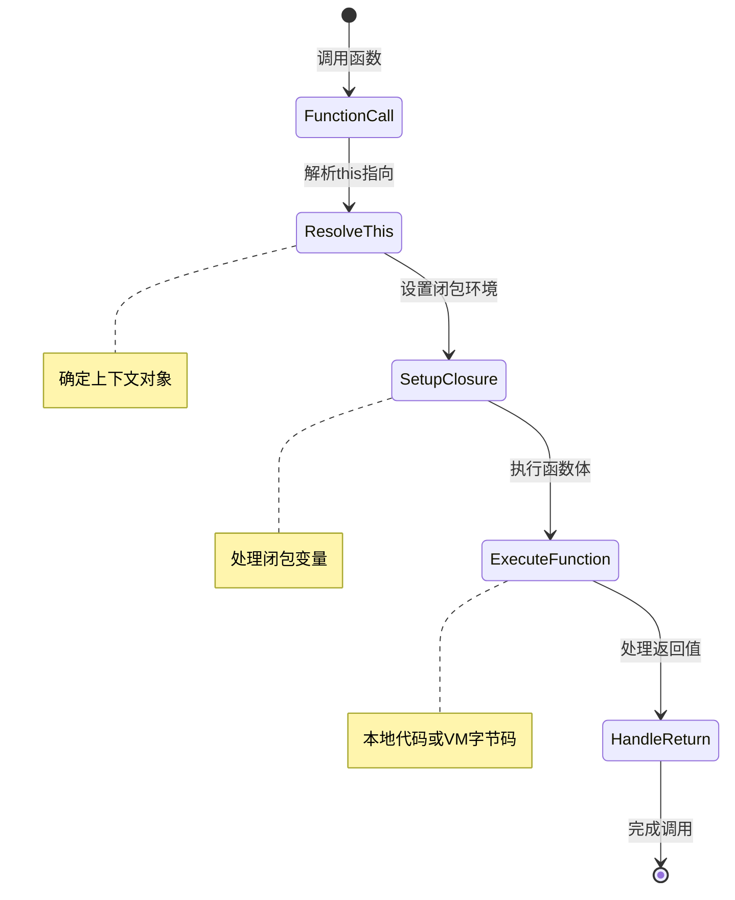
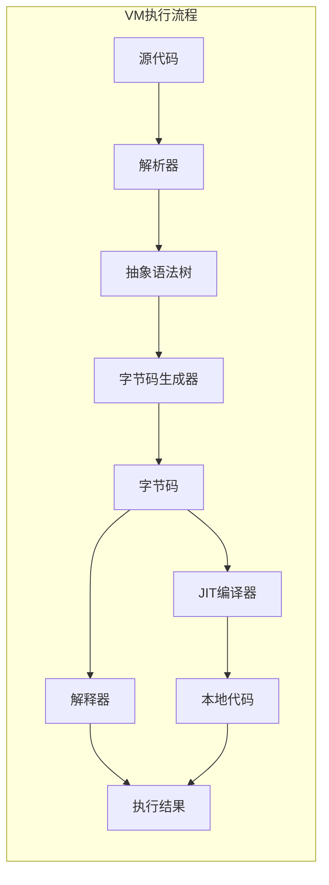
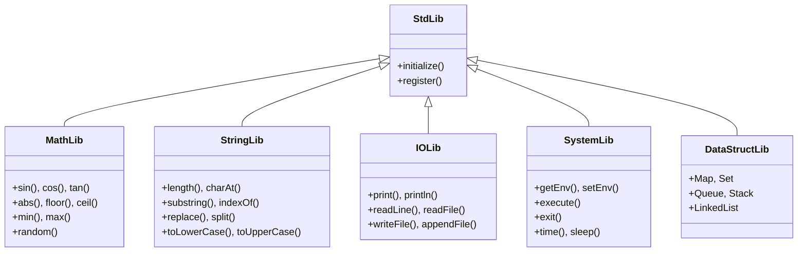
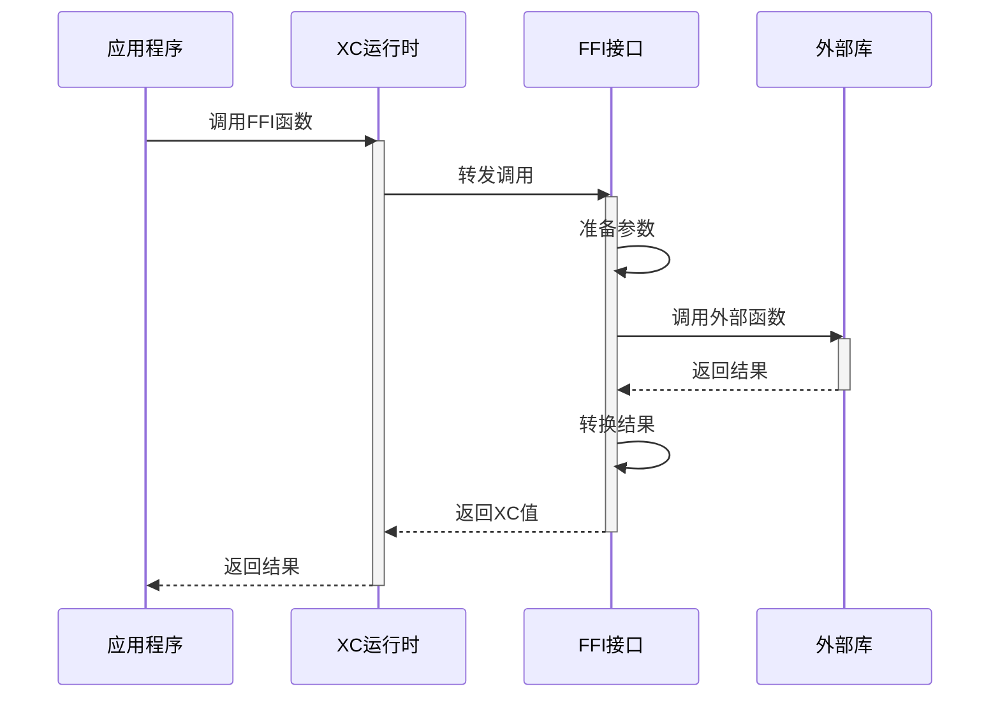
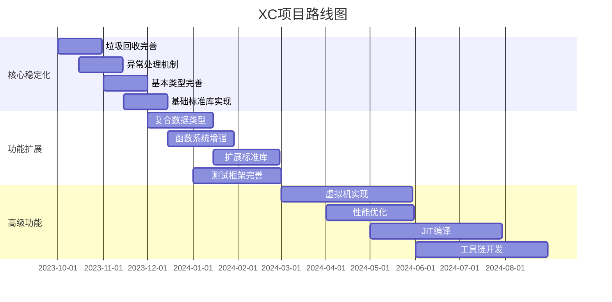

# XC 微运行时规格文档

## 项目概述

XC 是一个精巧而强大的高级 C 运行时库，设计目标是提供现代编程语言特性，同时保持与 C 语言的无缝集成。XC 提供了类型系统、自动垃圾回收、异常处理等关键特性，使开发者能够在 C 语言环境中获得更高层次的抽象能力。

## 系统架构

```mermaid
flowchart TB
    subgraph XC["XC 运行时核心"]
        direction TB
        Core[核心运行时] --> TypeSystem[类型系统]
        Core --> MemoryManager[内存管理]
        Core --> FunctionSys[函数系统]
        Core --> ErrorHandling[错误处理]
        Core --> VM[虚拟机]
    end
    
    subgraph TypeSys["类型系统详情"]
        direction TB
        TypeSystem --> BasicTypes[基本类型]
        TypeSystem --> CompositeTypes[复合类型]
        TypeSystem --> TypeRegistry[类型注册机制]
        
        BasicTypes --> Null[Null]
        BasicTypes --> Boolean[Boolean]
        BasicTypes --> Number[Number]
        BasicTypes --> String[String]
        
        CompositeTypes --> Array[Array]
        CompositeTypes --> Object[Object]
        CompositeTypes --> Function[Function]
    end
    
    subgraph MemMgr["内存管理详情"]
        direction TB
        MemoryManager --> ObjectAlloc[对象分配]
        MemoryManager --> GC[垃圾回收]
        MemoryManager --> MemStats[内存统计]
        
        GC --> MarkPhase[标记阶段]
        GC --> SweepPhase[清除阶段]
        GC --> TriColor[三色标记算法]
        GC --> CycleDetect[循环引用检测]
    end
    
    subgraph FuncSys["函数系统详情"]
        direction TB
        FunctionSys --> NativeFuncs[本地函数]
        FunctionSys --> VMFuncs[VM函数]
        FunctionSys --> FFIFuncs[FFI函数]
        FunctionSys --> Closures[闭包实现]
        
        NativeFuncs --> StdLib[标准库函数]
        NativeFuncs --> UserFunc[用户自定义函数]
    end
    
    subgraph ErrHandle["错误处理详情"]
        direction TB
        ErrorHandling --> ErrorTypes[错误类型]
        ErrorHandling --> ExceptionMech[异常机制]
        ErrorHandling --> StackTrace[堆栈追踪]
        
        ExceptionMech --> TryCatch[Try-Catch]
        ExceptionMech --> Finally[Finally块]
        ExceptionMech --> ErrorChain[异常链]
    end
    
    subgraph VMEngine["虚拟机详情"]
        direction TB
        VM --> ByteCode[字节码]
        VM --> Interpreter[解释器]
        VM --> JIT[JIT编译]
        VM --> Optimizer[优化器]
    end
    
    subgraph StdLibrary["标准库"]
        direction TB
        StdMath[数学库]
        StdString[字符串库]
        StdIO[输入输出库]
        StdSystem[系统库]
        StdDS[数据结构库]
    end
    
    XC --> StdLibrary
    XC --> AppCode[应用代码]
    C_Runtime[C运行时] --> XC
```



## 核心组件详细规格

### 1. 类型系统



#### 1.1 基本类型

- **Null类型**: 表示空值或未初始化
- **Boolean类型**: 布尔值（true/false）
- **Number类型**: 64位双精度浮点数
- **String类型**: UTF-8编码的字符串，支持完整的Unicode

#### 1.2 复合类型

- **Array类型**: 动态数组，支持变长存储和随机访问
- **Object类型**: 键值对集合，支持动态属性添加和方法
- **Function类型**: 一等公民函数，支持闭包和上下文绑定

#### 1.3 类型转换规则

| 源类型\\目标类型 | Boolean | Number | String | Object |
|--------------|---------|--------|--------|--------|
| Null         | false   | 0      | "null" | 错误    |
| Boolean      | -       | 0/1    | "true"/"false" | 包装对象 |
| Number       | 0为false，非0为true | - | 数字字符串 | 包装对象 |
| String       | 空为false，非空为true | 解析数字，失败则NaN | - | 包装对象 |
| Object       | true    | valueOf或NaN | toString结果 | - |

### 2. 内存管理



#### 2.1 对象头部结构

```c
// 对象头部结构
typedef struct {
    uint8_t type;           // 类型标识
    uint8_t gc_flags;       // GC标志位
    uint16_t flags;         // 其他标志
    uint32_t size;          // 对象大小
    void* type_info;        // 类型信息指针
} xc_obj_header_t;
```

#### 2.2 垃圾回收策略

- **算法**: 三色标记-清除算法
- **触发条件**: 
  - 内存分配达到阈值时
  - 显式调用时
  - 空闲时进行增量回收
- **循环引用处理**: 使用标记-清除检测循环引用
- **性能优化**: 分代收集、增量回收

### 3. 函数系统



#### 3.1 函数数据结构

```c
// 函数处理器类型
typedef xc_val (*xc_function_handler)(xc_val this_obj, int argc, xc_val* argv, xc_val closure);

// 函数对象结构
typedef struct {
    xc_function_handler handler;  // 函数处理器
    xc_val this_obj;              // 绑定的this对象
    xc_val closure;               // 闭包环境
    int arg_count;                // 参数数量
    unsigned char type;           // 函数子类型
    void* extra_data;             // 子类型特定数据
} xc_function_t;
```

#### 3.2 函数类型层次结构

```
xc_function (基础层)
    ├── xc_native_function (本地函数)
    │     ├── xc_std_function (标准库函数)
    │     └── xc_user_function (用户自定义本地函数)
    ├── xc_vm_function (字节码函数)
    └── xc_ffi_function (外部接口函数)
```

### 4. 错误处理

```mermaid
sequenceDiagram
    participant App as 应用代码
    participant Try as Try块
    participant XC as XC运行时
    participant Catch as Catch块
    participant Finally as Finally块
    
    App->>Try: 执行代码
    activate Try
    Try->>XC: 调用可能抛出异常的函数
    activate XC
    
    alt 发生异常
        XC-->>Try: 抛出异常
        deactivate XC
        Try-->>Catch: 传递异常对象
        deactivate Try
        activate Catch
        Catch->>Catch: 处理异常
        Catch-->>Finally: 完成处理
        deactivate Catch
    else 正常完成
        XC-->>Try: 返回结果
        deactivate XC
        Try-->>Finally: 完成执行
        deactivate Try
    end
    
    activate Finally
    Finally->>Finally: 清理资源
    Finally-->>App: 继续执行
    deactivate Finally
```

#### 4.1 异常对象结构

```c
// 异常对象结构
typedef struct {
    char* message;           // 错误消息
    char* file;              // 发生错误的文件
    int line;                // 发生错误的行号
    xc_val cause;            // 导致此异常的原因（链式异常）
    void* stack_trace;       // 堆栈跟踪信息
} xc_exception_t;
```

#### 4.2 异常类型

- **SyntaxError**: 语法错误
- **TypeError**: 类型错误
- **ReferenceError**: 引用错误
- **RangeError**: 范围错误
- **MemoryError**: 内存错误
- **IOError**: 输入/输出错误
- **AssertError**: 断言错误

### 5. 虚拟机



#### 5.1 字节码指令集

| 操作码 | 名称 | 描述 |
|-------|------|------|
| 0x01 | LOAD_CONST | 加载常量 |
| 0x02 | LOAD_VAR | 加载变量 |
| 0x03 | STORE_VAR | 存储变量 |
| 0x04 | ADD | 加法操作 |
| 0x05 | SUB | 减法操作 |
| 0x06 | MUL | 乘法操作 |
| 0x07 | DIV | 除法操作 |
| 0x08 | CALL | 调用函数 |
| 0x09 | RETURN | 返回值 |
| 0x0A | JUMP | 无条件跳转 |
| 0x0B | JUMP_IF | 条件跳转 |
| 0x0C | NEW_ARRAY | 创建数组 |
| 0x0D | NEW_OBJECT | 创建对象 |
| 0x0E | GET_PROP | 获取属性 |
| 0x0F | SET_PROP | 设置属性 |
| 0x10 | TRY_BEGIN | 开始try块 |
| 0x11 | TRY_END | 结束try块 |
| 0x12 | THROW | 抛出异常 |

## 标准库



## 外部接口集成



## 性能指标

| 特性 | 目标性能 | 当前状态 |
|------|---------|---------|
| 对象创建 | < 100ns | 待测试 |
| 方法调用 | < 50ns | 待测试 |
| 垃圾回收暂停 | < 10ms | 待测试 |
| 内存占用 | < 2x 原生C | 待测试 |
| 启动时间 | < 50ms | 待测试 |

## 发展路线图



## 集成示例

以下是将XC集成到C项目中的示例代码：

```c
#include "xc.h"

// 自定义本地函数
xc_val my_function(xc_val this_obj, int argc, xc_val* argv, xc_val closure) {
    if (argc < 1) return xc_throw("Not enough arguments");
    
    xc_val arg = argv[0];
    if (!xc_is_number(arg)) return xc_throw("Expected number");
    
    double value = xc_to_number(arg);
    return xc_number(value * 2);
}

int main() {
    // 初始化XC运行时
    xc_init();
    
    // 注册自定义函数
    xc_val func = xc_register_native_function("doubleIt", my_function, 1);
    xc_set_global("doubleIt", func);
    
    // 创建和操作XC值
    xc_val arr = xc_array();
    xc_array_push(arr, xc_number(10));
    xc_array_push(arr, xc_string("Hello"));
    
    // 使用try-catch处理异常
    xc_try {
        xc_val result = xc_call(func, xc_null(), 1, xc_array_get(arr, 0));
        printf("Result: %f\n", xc_to_number(result));
    } xc_catch(e) {
        printf("Error: %s\n", xc_exception_message(e));
    } xc_finally {
        // 清理资源
        xc_release(arr);
        xc_release(func);
    }
    
    // 关闭XC运行时
    xc_shutdown();
    return 0;
}
```

## 兼容性和要求

- **支持平台**: Linux, macOS, Windows
- **C标准**: C99及以上
- **内存需求**: 最低4MB RAM
- **依赖库**: 无外部依赖
- **线程安全**: 支持多线程隔离

## 代码审查报告

### 1. 代码结构和组织评估

#### 1.1 整体架构

XC 项目采用了清晰的分层架构设计：
- **底层基础设施层（infrax）**：提供内存管理、线程、网络等基础功能
- **核心运行时层（xc）**：实现类型系统、垃圾回收、异常处理等核心功能
- **标准库层（xc_std）**：提供常用功能的标准实现
- **对外接口层（libxc.h）**：提供统一的公共 API

这种分层设计有利于关注点分离，使得各层可以独立演进，同时保持良好的兼容性。

#### 1.2 代码组织

源代码组织结构合理：
- `src/xc/`：核心运行时代码
- `src/xc/xc_types/`：类型系统实现
- `src/xc/xc_std/`：标准库实现
- `src/infrax/`：基础设施层代码
- `include/`：公共头文件
- `test/`：测试代码

这种组织方式使得代码结构清晰，便于维护和扩展。

#### 1.3 构建系统

项目使用 Makefile 和自定义构建脚本管理构建过程，支持多种构建目标：
- `make all`：构建 libxc.a 和测试程序
- `make libxc`：只构建 libxc.a 静态库
- `make test`：构建并运行测试程序
- `make clean`：清理所有构建产物

构建系统设计合理，支持并行构建，提高了构建效率。

### 2. 内存管理机制审查

#### 2.1 从引用计数到纯 GC 的转变

项目最近从混合内存管理（引用计数 + GC）转向了纯 GC 系统。这一转变的主要动机是：
- 简化内存管理逻辑
- 解决引用计数无法处理的循环引用问题
- 减少开发者的心智负担

代码中仍然存在一些引用计数的遗留痕迹，如 `xc_object_t` 结构中被注释掉的 `ref_count` 字段，以及一些被注释掉的 `xc_gc_free` 调用。

#### 2.2 当前 GC 实现

当前的 GC 实现基于三色标记-清除算法：
- **白色**：可能不可达的对象，是回收的候选者
- **灰色**：已知可达但其引用尚未处理的对象
- **黑色**：已知可达且其所有引用都已处理的对象
- **永久**：特殊标记，表示对象永远不会被回收

GC 系统使用三个链表来管理不同颜色的对象：
- `white_list`：白色对象链表
- `gray_list`：灰色对象链表
- `black_list`：黑色对象链表

#### 2.3 内存管理相关问题

1. **代码清理不完全**：仍有部分引用计数相关的代码被注释而非删除，如 `array_free` 函数中的注释代码
2. **资源释放逻辑不一致**：某些资源使用 `free` 直接释放，而非通过 GC 机制
3. **根对象管理机制不完善**：根对象 API 存在但测试中被标记为"未完全实现"
4. **缺少弱引用支持**：当前实现没有弱引用机制，可能导致某些场景下的内存管理困难
5. **缺少终结器机制**：没有对象终结器（finalizer）的实现，限制了资源管理的灵活性

### 3. API 设计和一致性分析

#### 3.1 API 设计原则

XC 的 API 设计遵循以下原则：
- **简洁性**：API 简洁明了，易于理解和使用
- **一致性**：API 命名和参数顺序保持一致
- **灵活性**：提供多种方式操作对象和值
- **安全性**：类型检查和错误处理机制

#### 3.2 核心 API 结构

核心 API 通过 `xc_runtime_t` 结构体提供，包括：
- 对象创建和管理：`alloc`、`new`
- 类型系统：`type_of`、`is`、`register_type`
- 函数调用：`call`、`dot`、`invoke`
- 异常处理：`try_catch_finally`、`throw`

#### 3.3 API 一致性问题

1. **命名不一致**：部分函数使用 `xc_` 前缀，部分直接使用函数名
2. **参数顺序不一致**：某些函数将 `xc_runtime_t *rt` 作为第一个参数，某些则不是
3. **错误处理方式不一致**：部分函数返回错误码，部分抛出异常，部分返回 NULL
4. **文档不完整**：部分 API 缺少详细文档说明
5. **TODO 注释过多**：代码中存在大量 TODO 注释，表明 API 设计尚未完全稳定

### 4. 类型系统实现评估

#### 4.1 类型系统架构

XC 的类型系统基于 `xc_type_lifecycle_t` 结构，为每种类型提供统一的生命周期管理：
- 初始化函数：`initializer`
- 清理函数：`cleaner`
- 创建函数：`creator`
- 销毁函数：`destroyer`
- GC 标记函数：`marker`
- 值访问和转换函数：`get_value`、`convert_to`

#### 4.2 基本类型实现

项目实现了以下基本类型：
- `XC_TYPE_NULL`：空值类型
- `XC_TYPE_BOOL`：布尔类型
- `XC_TYPE_NUMBER`：数值类型
- `XC_TYPE_STRING`：字符串类型
- `XC_TYPE_EXCEPTION`：异常类型
- `XC_TYPE_FUNC`：函数类型
- `XC_TYPE_ARRAY`：数组类型
- `XC_TYPE_OBJECT`：对象类型

#### 4.3 类型系统相关问题

1. **类型注册机制复杂**：类型注册过程涉及多个步骤，容易出错
2. **类型转换规则不明确**：类型间转换规则文档化不足
3. **类型系统扩展性有限**：用户自定义类型的支持机制不完善
4. **类型检查不严格**：部分操作缺少严格的类型检查
5. **类型系统与 GC 耦合过紧**：类型系统与 GC 机制紧密耦合，增加了维护难度

### 5. 潜在的 bug 和改进点

#### 5.1 潜在 bug

1. **内存泄漏风险**：
   - `array_free` 函数中的注释代码表明资源释放逻辑可能不完整
   - 某些对象的 `free` 函数没有正确释放所有资源

2. **并发安全问题**：
   - GC 机制没有考虑多线程环境下的同步问题
   - 全局变量 `rt` 在多线程环境下可能导致竞态条件

3. **异常处理缺陷**：
   - 异常处理机制可能在嵌套调用时出现问题
   - 未捕获异常的处理逻辑不完善

4. **类型转换问题**：
   - 类型转换函数可能在处理边界情况时出错
   - 数值类型转换可能存在精度丢失问题

5. **资源管理问题**：
   - 缺少对外部资源（如文件句柄、网络连接）的自动管理机制
   - GC 回收时机不可预测，可能导致资源释放延迟

#### 5.2 改进点

1. **代码清理**：
   - 彻底清理引用计数相关的遗留代码
   - 移除或实现 TODO 注释标记的功能

2. **API 改进**：
   - 统一 API 命名和参数顺序
   - 完善 API 文档
   - 添加 `delete` API 用于显式资源释放

3. **GC 增强**：
   - 实现增量 GC 或并发 GC 以减少暂停时间
   - 添加弱引用支持
   - 实现终结器（finalizer）机制

4. **类型系统增强**：
   - 简化类型注册机制
   - 完善用户自定义类型支持
   - 增强类型检查和类型转换安全性

5. **测试增强**：
   - 完善 GC 相关测试
   - 添加性能测试和基准测试
   - 增加边界条件和错误处理测试

### 6. 性能优化机会

#### 6.1 GC 性能优化

1. **增量 GC**：
   - 将 GC 工作分散到多个小步骤，减少暂停时间
   - 实现时间片分配机制，控制每次 GC 的最大执行时间

2. **并发 GC**：
   - 在后台线程中运行 GC，减少对主线程的影响
   - 实现写屏障（write barrier）机制，确保并发 GC 的正确性

3. **分代 GC**：
   - 根据对象年龄分类处理，提高效率
   - 实现年轻代和老年代分离，针对不同代采用不同的 GC 策略

4. **GC 触发策略优化**：
   - 优化 GC 触发阈值，减少不必要的 GC 周期
   - 实现自适应 GC 策略，根据运行时状态调整 GC 行为

#### 6.2 内存分配优化

1. **对象池**：
   - 为常用小对象实现对象池，减少内存分配开销
   - 实现特定类型的专用分配器

2. **内存布局优化**：
   - 优化对象内存布局，提高缓存命中率
   - 减少内存碎片化

3. **内联缓存**：
   - 实现属性访问的内联缓存，加速对象属性查找
   - 优化方法调用路径

#### 6.3 其他性能优化

1. **JIT 编译**：
   - 实现简单的 JIT 编译器，将热点代码编译为本地代码
   - 支持内联优化和代码特化

2. **并行处理**：
   - 利用多核处理器，并行化适合的操作
   - 实现工作窃取（work stealing）调度算法

3. **惰性计算**：
   - 对适合的操作实现惰性计算，避免不必要的计算
   - 实现值的按需计算机制

### 7. 总结与建议

XC 项目是一个设计良好的轻量级 C 运行时库，提供了类型系统、自动垃圾回收、异常处理等现代编程语言特性。最近从引用计数转向纯 GC 的变更是一个积极的改进，简化了内存管理逻辑。

#### 7.1 短期改进建议

1. **完成 GC 转型**：
   - 彻底清理引用计数相关代码
   - 确保所有类型实现都使用纯 GC 方式
   - 完善 GC 测试

2. **API 一致性**：
   - 统一 API 命名和参数顺序
   - 完善 API 文档
   - 解决 TODO 标记的问题

3. **修复潜在 bug**：
   - 解决内存泄漏风险
   - 修复异常处理缺陷
   - 增强类型转换安全性

#### 7.2 中期改进建议

1. **GC 增强**：
   - 实现增量 GC
   - 添加弱引用支持
   - 实现终结器机制

2. **类型系统增强**：
   - 简化类型注册机制
   - 完善用户自定义类型支持
   - 增强类型检查

3. **性能优化**：
   - 实现对象池
   - 优化内存布局
   - 实现内联缓存

#### 7.3 长期改进建议

1. **高级 GC 特性**：
   - 实现并发 GC
   - 实现分代 GC
   - 实现自适应 GC 策略

2. **JIT 编译**：
   - 实现简单的 JIT 编译器
   - 支持内联优化和代码特化

3. **并行处理**：
   - 利用多核处理器
   - 实现工作窃取调度算法

通过实施这些改进，XC 项目可以进一步提高其稳定性、性能和可用性，成为一个更加成熟和强大的 C 运行时库。 