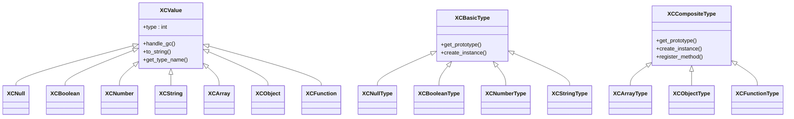
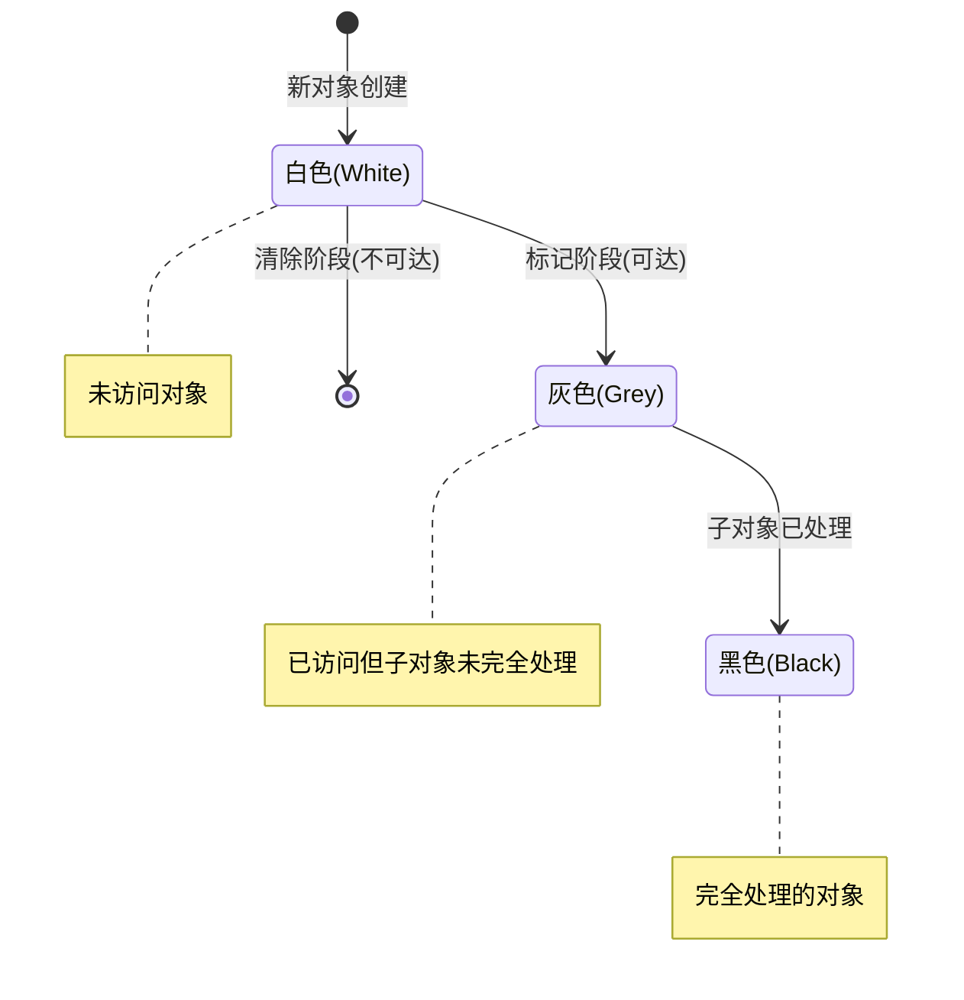
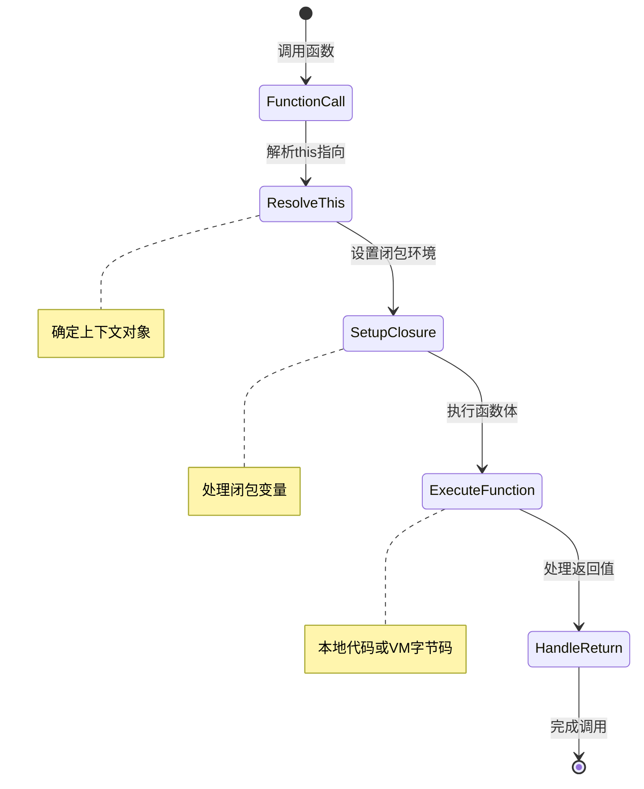
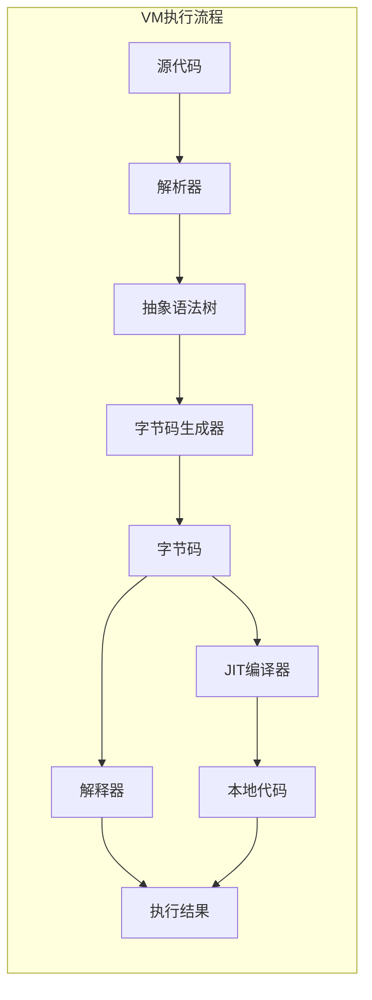
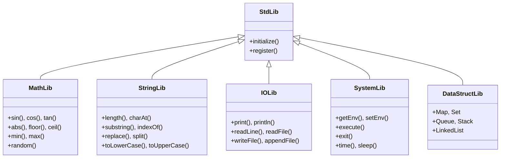
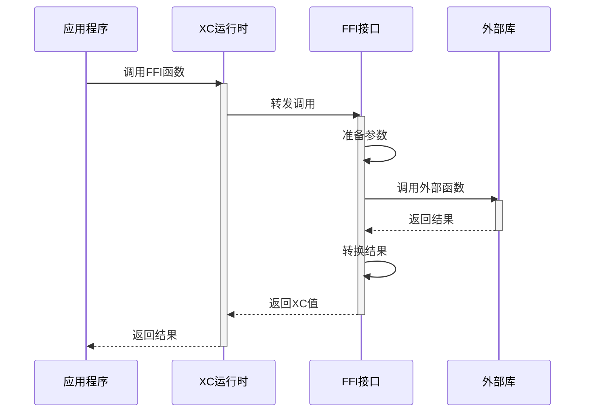
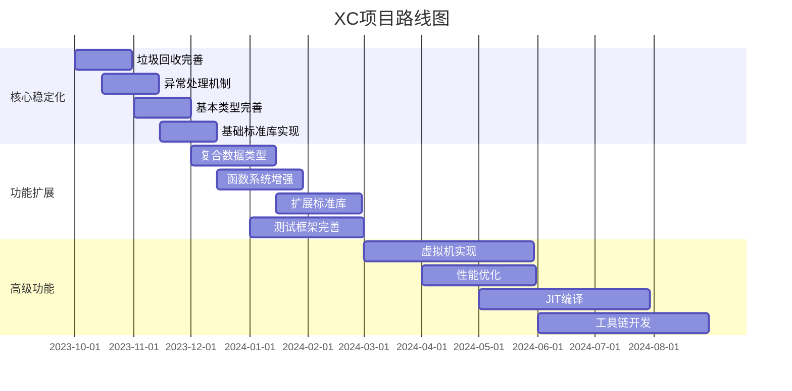

# XC 微运行时规格文档

## 项目概述

XC 是一个精巧而强大的高级 C 运行时库，设计目标是提供现代编程语言特性，同时保持与 C 语言的无缝集成。XC 提供了类型系统、自动垃圾回收、异常处理等关键特性，使开发者能够在 C 语言环境中获得更高层次的抽象能力。

## 系统架构

```mermaid
flowchart TB
    subgraph XC["XC 运行时核心"]
        direction TB
        Core[核心运行时] --> TypeSystem[类型系统]
        Core --> MemoryManager[内存管理]
        Core --> FunctionSys[函数系统]
        Core --> ErrorHandling[错误处理]
        Core --> VM[虚拟机]
    end
    
    subgraph TypeSys["类型系统详情"]
        direction TB
        TypeSystem --> BasicTypes[基本类型]
        TypeSystem --> CompositeTypes[复合类型]
        TypeSystem --> TypeRegistry[类型注册机制]
        
        BasicTypes --> Null[Null]
        BasicTypes --> Boolean[Boolean]
        BasicTypes --> Number[Number]
        BasicTypes --> String[String]
        
        CompositeTypes --> Array[Array]
        CompositeTypes --> Object[Object]
        CompositeTypes --> Function[Function]
    end
    
    subgraph MemMgr["内存管理详情"]
        direction TB
        MemoryManager --> ObjectAlloc[对象分配]
        MemoryManager --> GC[垃圾回收]
        MemoryManager --> MemStats[内存统计]
        
        GC --> MarkPhase[标记阶段]
        GC --> SweepPhase[清除阶段]
        GC --> TriColor[三色标记算法]
        GC --> CycleDetect[循环引用检测]
    end
    
    subgraph FuncSys["函数系统详情"]
        direction TB
        FunctionSys --> NativeFuncs[本地函数]
        FunctionSys --> VMFuncs[VM函数]
        FunctionSys --> FFIFuncs[FFI函数]
        FunctionSys --> Closures[闭包实现]
        
        NativeFuncs --> StdLib[标准库函数]
        NativeFuncs --> UserFunc[用户自定义函数]
    end
    
    subgraph ErrHandle["错误处理详情"]
        direction TB
        ErrorHandling --> ErrorTypes[错误类型]
        ErrorHandling --> ExceptionMech[异常机制]
        ErrorHandling --> StackTrace[堆栈追踪]
        
        ExceptionMech --> TryCatch[Try-Catch]
        ExceptionMech --> Finally[Finally块]
        ExceptionMech --> ErrorChain[异常链]
    end
    
    subgraph VMEngine["虚拟机详情"]
        direction TB
        VM --> ByteCode[字节码]
        VM --> Interpreter[解释器]
        VM --> JIT[JIT编译]
        VM --> Optimizer[优化器]
    end
    
    subgraph StdLibrary["标准库"]
        direction TB
        StdMath[数学库]
        StdString[字符串库]
        StdIO[输入输出库]
        StdSystem[系统库]
        StdDS[数据结构库]
    end
    
    XC --> StdLibrary
    XC --> AppCode[应用代码]
    C_Runtime[C运行时] --> XC
```



## 核心组件详细规格

### 1. 类型系统



#### 1.1 基本类型

- **Null类型**: 表示空值或未初始化
- **Boolean类型**: 布尔值（true/false）
- **Number类型**: 64位双精度浮点数
- **String类型**: UTF-8编码的字符串，支持完整的Unicode

#### 1.2 复合类型

- **Array类型**: 动态数组，支持变长存储和随机访问
- **Object类型**: 键值对集合，支持动态属性添加和方法
- **Function类型**: 一等公民函数，支持闭包和上下文绑定

#### 1.3 类型转换规则

| 源类型\\目标类型 | Boolean | Number | String | Object |
|--------------|---------|--------|--------|--------|
| Null         | false   | 0      | "null" | 错误    |
| Boolean      | -       | 0/1    | "true"/"false" | 包装对象 |
| Number       | 0为false，非0为true | - | 数字字符串 | 包装对象 |
| String       | 空为false，非空为true | 解析数字，失败则NaN | - | 包装对象 |
| Object       | true    | valueOf或NaN | toString结果 | - |

### 2. 内存管理



#### 2.1 对象头部结构

```c
// 对象头部结构
typedef struct {
    uint8_t type;           // 类型标识
    uint8_t gc_flags;       // GC标志位
    uint16_t flags;         // 其他标志
    uint32_t size;          // 对象大小
    void* type_info;        // 类型信息指针
} xc_obj_header_t;
```

#### 2.2 垃圾回收策略

- **算法**: 三色标记-清除算法
- **触发条件**: 
  - 内存分配达到阈值时
  - 显式调用时
  - 空闲时进行增量回收
- **循环引用处理**: 使用标记-清除检测循环引用
- **性能优化**: 分代收集、增量回收

### 3. 函数系统



#### 3.1 函数数据结构

```c
// 函数处理器类型
typedef xc_val (*xc_function_handler)(xc_val this_obj, int argc, xc_val* argv, xc_val closure);

// 函数对象结构
typedef struct {
    xc_function_handler handler;  // 函数处理器
    xc_val this_obj;              // 绑定的this对象
    xc_val closure;               // 闭包环境
    int arg_count;                // 参数数量
    unsigned char type;           // 函数子类型
    void* extra_data;             // 子类型特定数据
} xc_function_t;
```

#### 3.2 函数类型层次结构

```
xc_function (基础层)
    ├── xc_native_function (本地函数)
    │     ├── xc_std_function (标准库函数)
    │     └── xc_user_function (用户自定义本地函数)
    ├── xc_vm_function (字节码函数)
    └── xc_ffi_function (外部接口函数)
```

### 4. 错误处理

```mermaid
sequenceDiagram
    participant App as 应用代码
    participant Try as Try块
    participant XC as XC运行时
    participant Catch as Catch块
    participant Finally as Finally块
    
    App->>Try: 执行代码
    activate Try
    Try->>XC: 调用可能抛出异常的函数
    activate XC
    
    alt 发生异常
        XC-->>Try: 抛出异常
        deactivate XC
        Try-->>Catch: 传递异常对象
        deactivate Try
        activate Catch
        Catch->>Catch: 处理异常
        Catch-->>Finally: 完成处理
        deactivate Catch
    else 正常完成
        XC-->>Try: 返回结果
        deactivate XC
        Try-->>Finally: 完成执行
        deactivate Try
    end
    
    activate Finally
    Finally->>Finally: 清理资源
    Finally-->>App: 继续执行
    deactivate Finally
```

#### 4.1 异常对象结构

```c
// 异常对象结构
typedef struct {
    char* message;           // 错误消息
    char* file;              // 发生错误的文件
    int line;                // 发生错误的行号
    xc_val cause;            // 导致此异常的原因（链式异常）
    void* stack_trace;       // 堆栈跟踪信息
} xc_exception_t;
```

#### 4.2 异常类型

- **SyntaxError**: 语法错误
- **TypeError**: 类型错误
- **ReferenceError**: 引用错误
- **RangeError**: 范围错误
- **MemoryError**: 内存错误
- **IOError**: 输入/输出错误
- **AssertError**: 断言错误

### 5. 虚拟机



#### 5.1 字节码指令集

| 操作码 | 名称 | 描述 |
|-------|------|------|
| 0x01 | LOAD_CONST | 加载常量 |
| 0x02 | LOAD_VAR | 加载变量 |
| 0x03 | STORE_VAR | 存储变量 |
| 0x04 | ADD | 加法操作 |
| 0x05 | SUB | 减法操作 |
| 0x06 | MUL | 乘法操作 |
| 0x07 | DIV | 除法操作 |
| 0x08 | CALL | 调用函数 |
| 0x09 | RETURN | 返回值 |
| 0x0A | JUMP | 无条件跳转 |
| 0x0B | JUMP_IF | 条件跳转 |
| 0x0C | NEW_ARRAY | 创建数组 |
| 0x0D | NEW_OBJECT | 创建对象 |
| 0x0E | GET_PROP | 获取属性 |
| 0x0F | SET_PROP | 设置属性 |
| 0x10 | TRY_BEGIN | 开始try块 |
| 0x11 | TRY_END | 结束try块 |
| 0x12 | THROW | 抛出异常 |

## 标准库



## 外部接口集成



## 性能指标

| 特性 | 目标性能 | 当前状态 |
|------|---------|---------|
| 对象创建 | < 100ns | 待测试 |
| 方法调用 | < 50ns | 待测试 |
| 垃圾回收暂停 | < 10ms | 待测试 |
| 内存占用 | < 2x 原生C | 待测试 |
| 启动时间 | < 50ms | 待测试 |

## 发展路线图



## 集成示例

以下是将XC集成到C项目中的示例代码：

```c
#include "xc.h"

// 自定义本地函数
xc_val my_function(xc_val this_obj, int argc, xc_val* argv, xc_val closure) {
    if (argc < 1) return xc_throw("Not enough arguments");
    
    xc_val arg = argv[0];
    if (!xc_is_number(arg)) return xc_throw("Expected number");
    
    double value = xc_to_number(arg);
    return xc_number(value * 2);
}

int main() {
    // 初始化XC运行时
    xc_init();
    
    // 注册自定义函数
    xc_val func = xc_register_native_function("doubleIt", my_function, 1);
    xc_set_global("doubleIt", func);
    
    // 创建和操作XC值
    xc_val arr = xc_array();
    xc_array_push(arr, xc_number(10));
    xc_array_push(arr, xc_string("Hello"));
    
    // 使用try-catch处理异常
    xc_try {
        xc_val result = xc_call(func, xc_null(), 1, xc_array_get(arr, 0));
        printf("Result: %f\n", xc_to_number(result));
    } xc_catch(e) {
        printf("Error: %s\n", xc_exception_message(e));
    } xc_finally {
        // 清理资源
        xc_release(arr);
        xc_release(func);
    }
    
    // 关闭XC运行时
    xc_shutdown();
    return 0;
}
```

## 兼容性和要求

- **支持平台**: Linux, macOS, Windows
- **C标准**: C99及以上
- **内存需求**: 最低4MB RAM
- **依赖库**: 无外部依赖
- **线程安全**: 支持多线程隔离

## 总结

XC微运行时提供了一套完整而强大的高级C运行时库，通过类型系统、自动垃圾回收、异常处理等现代编程语言特性，大幅提升C语言开发效率和代码质量。其轻量级设计和高度可扩展性使其适用于从嵌入式系统到高性能服务器的广泛应用场景。 