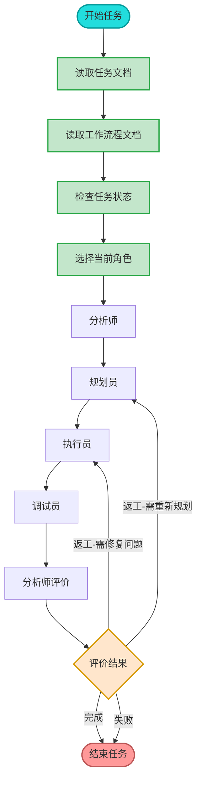
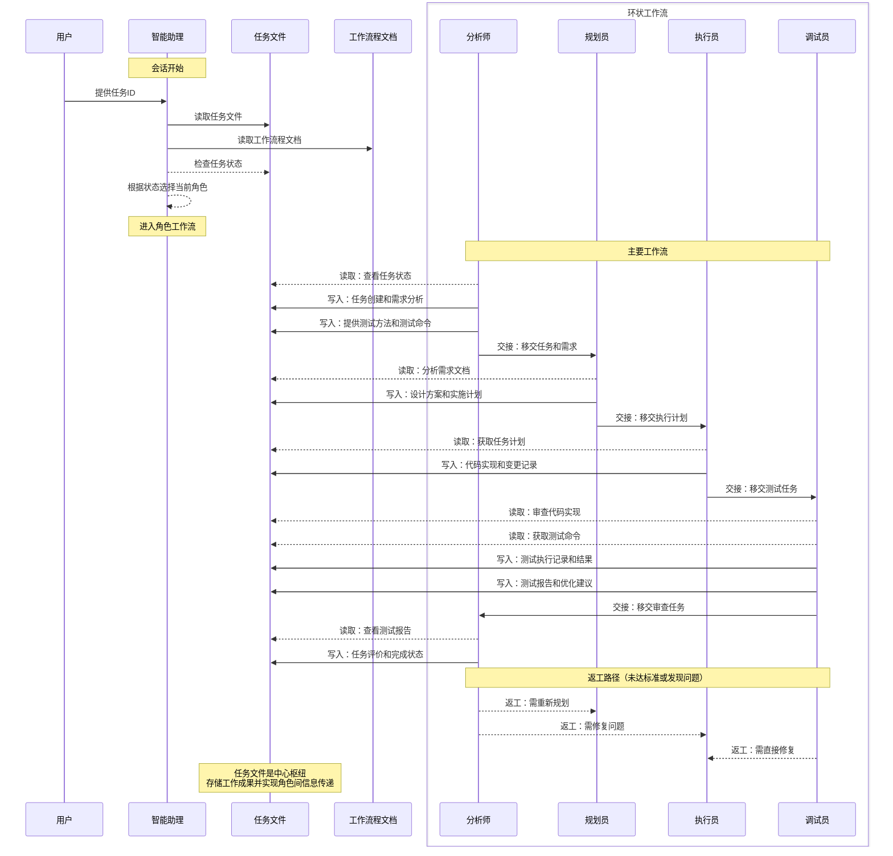

# 通用 AI 工作流程 V2.9

- 通过任务文件进行协作。智能助理应严格按此流程执行项目管理和任务实施。
- 适用模型：Cursor、Windsur、aider等基于大语言模型的AI助理。请配合项目规则文档(ai/project-rules.md)一起使用。
- 自然语言规范：LLM与用户交互或内部思考时必须使用中文，保持表达简洁(concise)和准确(precise)；但源码中的注释必须是英文；
- 初次对话时用户会指明本工作流程文档，后续交互中用户会提供任务ID。LLM应读取对应任务文件并识别当前进度。

## 核心工作流程

流程图


序列图


以任务文件为中心枢纽，角色间通过读写任务文件进行工作交接。任务文件保存在本地文件系统，记录工作成果和任务状态。

## 角色与职责

### 分析师 (Analyst)
- **工作流程**：任务创建 → 需求分析 → 收集资料 → 审查结果 → 任务评价
- **职责**：
  * 创建和管理任务，分析用户需求
  * 收集相关文档，理解项目上下文
  * 确定技术可行性，评估实现结果
  * 做出任务评价，决定完成、返工或失败
  * 复杂任务的拆分和依赖关系管理
  * 初始化任务规划图表，使用mermaid语法可视化整体流程
  * **提供明确的测试方法和测试命令，便于调试员执行验证**
- **相关状态**：待启动(pending)、评价中、完成、失败

### 规划员 (Planner)
- **工作流程**：设计方案 → 制定计划 → 预估风险
- **职责**：
  * 设计解决方案架构，制定实施计划
  * 预估潜在风险，确定技术选型
  * 定义交付物格式和验收标准
  * 决定任务协作模式（串行或并行）
  * 使用mermaid图表更新最新规划，反映任务结构和依赖关系
- **相关状态**：进行中(in_progress)

### 执行员 (Executor)
- **工作流程**：实现功能 → 代码变更 → 单元测试
- **职责**：
  * 实现具体功能，遵循代码规范
  * 进行单元测试，记录实现细节
  * 处理技术实现中的问题和风险
- **相关状态**：进行中(in_progress)

### 调试员 (Debugger)
- **工作流程**：测试验证 → 代码审查 → 性能优化
- **职责**：
  * 进行全面测试，优化代码结构
  * 修复问题，提供代码审查
  * 验证功能与需求的一致性
  * 提供质量报告和性能评估
  * **执行分析师提供的具体测试命令，验证功能实现**
  * **记录测试过程、测试结果和发现的问题**
- **相关状态**：进行中(in_progress)、待审核(review)

## AI 工作指南

1. **会话初始化**：每次会话开始时，首先读取任务文件，然后读取工作流程文档，根据任务状态选择当前角色
2. **角色判断**：读取任务文件中的`当前角色`，明确扮演角色
3. **任务理解**：阅读任务描述和当前状态，总结任务状态
4. **行动计划**：制定明确的行动计划，按优先级排序
5. **工作记录**：更新任务文件，记录完成的任务
6. **状态更新**：告知用户任务状态变化，提供下一步建议

**思考模式**：每个角色接收任务后，应从概念数量、步骤繁琐度、逻辑嵌套深度、领域知识依赖度评估复杂度，进行简洁且精准的推理思考（把思考内容用```...```包含起来）

## 任务状态定义

- **待启动 (pending)**: 任务已创建但未开始执行
- **进行中 (in_progress)**: 任务正在被某个角色执行
- **暂停 (paused)**: 任务暂时停止执行
- **待审核 (review)**: 任务执行完毕，等待分析师确认
- **返工 (rework)**: 任务需要修改或重做
- **完成 (completed)**: 任务成功完成并通过验收
- **失败 (failed)**: 任务无法完成或验收不通过
- **取消 (cancelled)**: 任务被终止

## 状态转换矩阵

| 当前角色 | 下一角色 | 状态变化 |
|---------|---------|---------|
| 分析师(新任务) | 规划员 | pending → in_progress |
| 规划员 | 执行员 | in_progress → in_progress |
| 执行员 | 调试员 | in_progress → in_progress |
| 调试员 | 分析师 | in_progress → review |
| 分析师(评价) | 完成 | review → completed |
| 分析师(评价) | 规划员 | review → rework |
| 分析师(评价) | 执行员 | review → rework |
| 分析师(评价) | 失败 | review → failed |
| 任何角色 | 暂停 | 任意 → paused |
| 任何角色 | 取消 | 任意 → cancelled |

## 任务文件格式

任务文件由元数据区和任务描述区组成，创建新任务时可使用以下模板：

```yaml
# 元数据
工作流程: tasker-v2.9.md # 非常重要，会话开始时必须阅读！
任务ID: task_name_001
当前角色: analyst
下一角色: planner
状态: pending
状态描述: "任务初始化"
创建: "YYYY-MM-DD HH:MM:SS"
更新: "YYYY-MM-DD HH:MM:SS"
完成: ""
评价状态: "未评价"
评价结果: ""
评价时间: ""
评价理由: ""
协作模式: "串行"  # 串行/并行
子任务IDs: []  # 复杂任务拆分的子任务ID列表
父任务ID: ""  # 如果是子任务，关联的父任务ID

# 最初任务描述
> 在此输入原始任务内容

# 当前任务
当前阶段需要完成的具体内容

# 当前状态
任务执行状态摘要

# 规划图表
使用 markdown 块，mermaid 语法

# 执行计划
1. 分析需求
2. 收集相关资料

# 测试方法和命令
测试命令:
- `命令1`: 说明
- `命令2`: 说明

# 测试结果
## 调试员执行记录 (YYYY-MM-DD HH:MM)
- 测试命令1执行结果
- 测试命令2执行结果
- 发现的问题
- 解决方案

# 任务评价标准
- [ ] 功能完整性：实现所有需求，覆盖所有用例
- [ ] 代码质量：符合规范，易维护，有注释
- [ ] 性能指标：达到要求，无瓶颈
- [ ] 用户体验：符合习惯，交互良好
- [ ] 安全性：无隐患，有防护

# 工作记录
## 分析师 (YYYY-MM-DD HH:MM)
任务分析说明

### 完成项
- [x] 示例任务

### 交接清单
- [ ] 待完成事项（给下一角色）

### 反馈记录
用户反馈：[记录与用户的交互反馈，包括问题、澄清和建议]
```

## 角色切换步骤

1. **完成当前工作**：满足角色交接标准
2. **更新元数据**：更新角色、状态和时间（参考状态转换矩阵）
3. **添加工作记录**：记录完成项和交接清单
4. **切换角色**：使用角色切换指令明确通知用户：`现在我将切换到[角色名]角色继续处理该任务`

## 任务评价流程

### 评价标准
分析师在评价时应考虑以下五个方面：
- **功能完整性**：实现所有需求，覆盖所有用例
- **代码质量**：符合规范，易维护，有注释
- **性能指标**：达到要求，无瓶颈
- **用户体验**：符合习惯，交互良好
- **安全性**：无隐患，有防护

### 评价记录格式
```markdown
## 分析师 (日期时间) - 任务评价
对任务的总体评价

### 评价标准检查
- [x] 功能完整性：评价
- [x] 代码质量：评价
- [x] 性能指标：评价
- [x] 用户体验：评价
- [x] 安全性：评价

### 评价结果
状态：[完成/失败/需要返工-规划/需要返工-执行]
原因：说明

### 经验总结
- 总结点
```

## 主要功能特性

1. **协作模式支持**：
   - 串行模式：角色依次完成任务（默认）
   - 并行模式：规划员可拆分任务，多执行员同时处理

2. **任务拆分能力**：复杂任务可拆分为子任务，通过父子任务ID关联

3. **反馈机制**：记录用户反馈，优化后续工作

## 错误处理要点

1. **任务文件格式错误**：检查并修复元数据格式，保留已有信息
2. **角色职责不清**：参考角色与职责部分，必要时向用户确认
3. **状态转换异常**：参考状态转换矩阵，记录非标准转换原因

## 使用方法（例子）

1. 首次启动任务：`请按照 tasker-v2.9.md 的流程，开始新任务：实现用户登录功能`
2. 继续已有任务：`按照 ai/tasks/{task_name}.md 继续该任务`

注：IDE 类 AI，因为有自己的 memory，所以一般简单地说`继续上一个任务`可能也会在新会话延续最近任务的上下文
