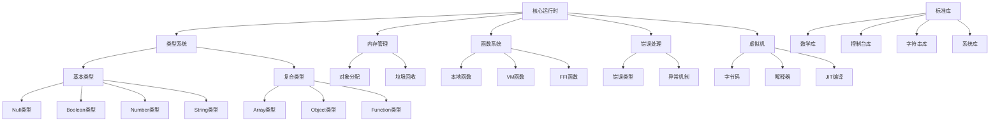

# XC 微运行时设计与发展规划

XC 是一个精巧的高级 C 运行时库，具有类型系统和自动垃圾回收等关键特性。本文档总结了 XC 微运行时的当前设计状态、完整性评估以及未来发展规划。

## 系统架构

XC系统主要由以下几个核心组件构成：



## 当前实现状态

根据代码分析和测试评估，XC项目的各核心组件实现状态如下：

### 1. 类型系统

- **基本类型**
  - ✅ Null类型：基础功能已实现
  - ✅ Boolean类型：基础功能已实现
  - ✅ Number类型：基础功能已实现
  - ✅ String类型：基础功能已实现，但部分方法未完成
  - ⚠️ 类型注册机制：框架已有，但功能不完整
  - ⚠️ 方法注册和调用：框架已有，但存在缺陷

- **复合类型**
  - ⚠️ Array类型：基本框架已有，大部分操作未实现
  - ⚠️ Object类型：基本框架已有，属性操作未完全实现
  - ⚠️ Function类型：创建和调用基础已有，闭包支持不完整

### 2. 内存管理

- ✅ 对象头部结构设计：已完成
- ✅ 基本对象分配：已实现
- ⚠️ 垃圾回收(三色标记法)：基础框架已有，但完整实现缺失
  - ⚠️ 标记阶段：基本逻辑已有，但可能存在边缘情况未处理
  - ❌ 清除阶段：实现不完整
  - ❌ 循环引用检测：尚未实现
  - ❌ 自动触发机制：尚未完全实现

### 3. 函数系统

- ✅ 函数类型定义：已完成
- ✅ 函数调用机制：基础已实现
- ⚠️ this绑定：基础功能已有，但边缘情况处理不完整
- ⚠️ 闭包环境：框架已有，但功能不完整
- ❌ 高级函数特性：未实现

### 4. 错误处理与异常机制

- ✅ 错误类型定义：已完成
- ✅ 错误信息管理：已实现
- ⚠️ try/catch机制：基础框架已有，但功能不完整
  - ⚠️ 基于setjmp/longjmp的非局部跳转：基本实现，但存在限制
  - ⚠️ 异常捕获和处理：基础实现，缺少完整功能
  - ❌ finally块：尚未完全实现
- ⚠️ 错误栈追踪：框架已有，但不完整
- ❌ 嵌套异常处理：尚未实现

### 5. 运行栈管理

- ⚠️ 调用栈跟踪：基础功能已有，但不完整
- ⚠️ 栈帧管理：基础实现，功能受限
- ❌ 异常处理与栈帧集成：尚未完全实现

### 6. 虚拟机

- ⚠️ VM类型已有基本框架
- ⚠️ 字节码指令集：初步定义，但不完整
- ❌ 执行引擎：尚未实现
- ❌ JIT编译支持：尚未实现

### 7. 标准库

- ⚠️ 数学函数库：基础框架已有，功能不完整
- ⚠️ 控制台库：基础功能已有，但有限
- ❌ 字符串处理库：尚未完全实现
- ❌ 系统调用库：尚未实现

## 设计上的完整性评估

从概念设计的角度看，XC微运行时的设计框架相当完整，但实现细节和功能完整性还有较大差距：

1. **类型系统**：✅ 设计完整，⚠️ 实现部分完成
2. **内存管理**：✅ 设计完整，⚠️ 实现部分完成
3. **函数系统**：✅ 设计完整，⚠️ 实现部分完成
4. **错误处理**：✅ 设计完整，⚠️ 实现部分完成
5. **运行栈管理**：✅ 设计完整，⚠️ 实现部分完成
6. **复合数据类型**：⚠️ 设计基本完成，❌ 实现大部分缺失
7. **虚拟机**：⚠️ 设计框架已有，❌ 实现大部分缺失
8. **标准库**：⚠️ 设计部分完成，❌ 实现大部分缺失

## 函数系统的组织架构

为了保持XC作为一个轻量级的微架构，同时提供足够的扩展性，以下是函数系统的分层设计：

### 1. 函数类型的分层设计

```
xc_function (基础层)
    ├── xc_native_function (本地函数)
    │     ├── xc_std_function (标准库函数)
    │     └── xc_user_function (用户自定义本地函数)
    ├── xc_vm_function (字节码函数)
    └── xc_ffi_function (外部接口函数)
```

### 2. 函数对象的统一接口

所有函数类型都应该实现相同的基础接口：

```c
// 函数处理器类型定义 - 统一接口
typedef xc_val (*xc_function_handler)(xc_val this_obj, int argc, xc_val* argv, xc_val closure);

// 函数类型数据结构 - 基础层
typedef struct {
    xc_function_handler handler;  // 函数处理器
    xc_val this_obj;              // 函数绑定的this对象
    xc_val closure;               // 闭包环境
    int arg_count;                // 参数数量
    unsigned char type;           // 函数子类型
    void* extra_data;             // 子类型特定数据
} xc_function_t;
```

### 3. 标准库的组织

标准库按功能模块组织，每个模块作为一个独立的C文件实现：

```
xc_std/
  ├── xc_std_math.c     // 数学函数
  ├── xc_std_string.c   // 字符串处理
  ├── xc_std_io.c       // 输入输出
  ├── xc_std_system.c   // 系统操作
  └── xc_std.c          // 标准库注册和初始化
```

### 4. 用户扩展API

为用户提供简单的API来注册自定义本地函数：

```c
// 在xc.h中添加
xc_val xc_register_native_function(const char* name, xc_function_handler handler, int arg_count);
```

## 发展路线图（修订版）

基于当前实现状态和项目目标，制定以下发展路线图：

### 阶段一：核心稳定化（1-3个月）

1. **垃圾回收系统完善**
   - 完善三色标记算法实现
   - 实现循环引用检测
   - 添加自动触发机制
   - 添加内存使用统计和监控
   - 解决当前的内存泄漏问题

2. **异常处理机制完善**
   - 完成try/catch基础功能
   - 实现finally块
   - 完善错误栈追踪
   - 实现异常链和嵌套异常处理

3. **基本类型完善**
   - 修复类型检查机制
   - 完善基本类型的方法实现
   - 统一方法调用接口

4. **基础标准库实现**
   - 实现基础数学函数
   - 实现基本字符串处理函数
   - 实现简单控制台I/O函数

### 阶段二：功能扩展（3-6个月）

1. **复合数据类型完善**
   - 完成Array类型的全部操作方法
   - 实现Object类型的完整功能
   - 添加高效的属性访问机制
   - 实现复合类型的序列化/反序列化

2. **函数系统增强**
   - 完善闭包机制
   - 实现完整的this绑定
   - 添加函数柯里化支持
   - 实现部分应用和高阶函数

3. **扩展标准库**
   - 完善字符串处理库
   - 添加日期/时间处理
   - 实现基本数据结构（如Map、Set）
   - 添加简单的文件I/O功能

4. **测试框架完善**
   - 建立完整的单元测试框架
   - 为所有功能添加测试用例
   - 实现性能基准测试
   - 添加内存使用分析工具

### 阶段三：高级功能（6个月以上）

1. **虚拟机实现**
   - 完善字节码指令集
   - 实现基本的解释执行引擎
   - 添加简单的优化机制
   - 实现源码到字节码的转换

2. **性能优化**
   - 实现基本的JIT编译功能
   - 优化内存管理和垃圾回收
   - 改进类型系统的性能
   - 优化方法调用和属性访问

3. **扩展功能**
   - 实现FFI机制
   - 添加模块加载系统
   - 实现异步执行支持
   - 添加多线程或并发支持

4. **生态系统**
   - 构建更完整的标准库
   - 提供与其他语言的互操作性
   - 开发调试工具
   - 创建示例应用

## 当前最优先任务清单

为了尽快实现一个最小可行产品(MVP)版本，我们需要优先完成以下任务：

### 1. 核心运行时稳定化

- **修复垃圾回收问题**
  - 解决当前的内存泄漏问题（高优先级）
  - 确保三色标记算法正确实现（高优先级）
  - 实现基本的自动触发机制（中优先级）
  - 添加内存使用统计（低优先级）

- **完善基本类型系统**
  - 修复类型检查机制（高优先级）
  - 确保所有基本类型方法的正确行为（高优先级）
  - 统一方法调用接口（中优先级）

- **异常处理基础实现**
  - 完善基本的try/catch机制（高优先级）
  - 实现基本的错误栈追踪（中优先级）
  - 添加finally块支持（中优先级）

### 2. 基础功能实现

- **基本的复合数据类型**
  - 实现Array类型的基本操作（高优先级）
  - 实现Object类型的基本属性操作（高优先级）
  - 确保基本的类型转换正确工作（中优先级）

- **函数系统基础**
  - 确保基本的函数调用正常工作（高优先级）
  - 实现基本的this绑定（中优先级）
  - 添加简单的闭包支持（中优先级）

- **标准库**
  - 实现最基本的数学函数（中优先级）
  - 实现简单的字符串处理函数（中优先级）
  - 完善控制台输出功能（高优先级）

### 3. 测试与文档

- **构建测试套件**
  - 为核心功能创建单元测试（高优先级）
  - 建立自动化测试框架（中优先级）
  - 创建集成测试用例（低优先级）

- **文档**
  - 更新API文档，反映当前实现状态（中优先级）
  - 创建简单的使用指南（中优先级）
  - 编写示例程序（低优先级）

## XC运行时与其他运行时的比较

XC运行时是一个轻量级的C运行时引擎，设计目标是提供类似于JavaScript/JVM/WASM的功能，但规模更小、更轻量。

### 优势

1. **极致轻量**：比主流JavaScript引擎小得多，内存占用更低
2. **C语言实现**：直接使用C语言编写，无需额外的语言转换层
3. **高度可嵌入**：设计为可嵌入到其他应用程序中，API简洁明了
4. **零依赖**：不依赖任何第三方库，便于移植和部署

### 劣势

1. **功能不完整**：相比成熟的JS引擎，功能集更小，标准库不完善
2. **性能优化**：缺乏JIT编译等高级优化技术
3. **生态系统**：没有庞大的第三方库和工具链支持
4. **标准化**：不遵循任何标准规范（如ECMAScript），API可能不稳定

### 适用场景

XC运行时最适合以下场景：

1. **嵌入式环境**：资源受限的设备，需要轻量级脚本引擎
2. **配置语言**：需要动态配置但不需要完整编程语言的场景
3. **简单扩展**：为C程序提供简单的脚本扩展能力
4. **教育目的**：学习运行时设计和实现的良好示例
5. **原型开发**：快速原型开发，不需要完整的语言特性